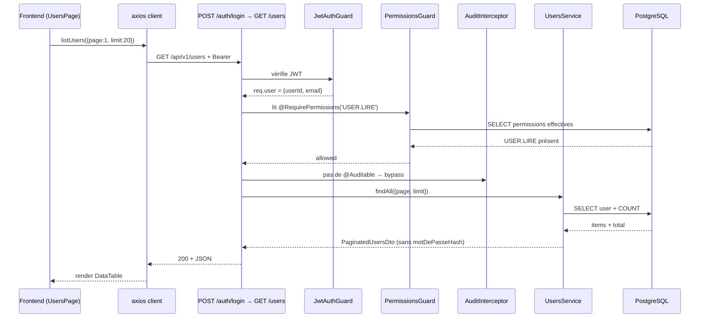

# Architecture — MIZNAS

> Transposition des 5 couches fonctionnelles des spécifications V1.0
> (avril 2026) en modules NestJS et React effectivement implémentés
> au Lot 1, et emplacements prévus pour les Lots 2 → 6.
>
> Ce document décrit le **réel** : chaque pattern cité a son équivalent
> dans le code existant. Les sections marquées « *prévu* » indiquent
> les emplacements réservés pour les modules métier à venir.

---

## Sommaire

1. [Principes structurants](#1-principes-structurants)
2. [Vue d'ensemble — les 5 couches](#2-vue-densemble--les-5-couches)
3. [Couche 1 — Présentation](#3-couche-1--présentation)
4. [Couche 2 — API & Sécurité](#4-couche-2--api--sécurité)
5. [Couche 3 — Application métier](#5-couche-3--application-métier)
6. [Couche 4 — Domaine & Données](#6-couche-4--domaine--données)
7. [Couche 5 — Plateforme & Observabilité](#7-couche-5--plateforme--observabilité)
8. [Arborescence backend `src/`](#8-arborescence-backend-src)
9. [Arborescence frontend `src/`](#9-arborescence-frontend-src)
10. [Flux d'une requête authentifiée](#10-flux-dune-requête-authentifiée)
11. [Évolutions prévues](#11-évolutions-prévues)
12. [Décisions techniques structurantes (ADR condensés)](#12-décisions-techniques-structurantes-adr-condensés)

---

## 1. Principes structurants

Cinq principes non négociables, appliqués depuis le Lot 1 et qui guident
toutes les évolutions.

### 1.1 API-first

Le frontend ne dialogue avec le backend **que** par l'API REST publiée
sous `/api/v1`. Aucune intégration directe (queries SQL, sockets,
fichiers partagés). L'API est la frontière contractuelle :

- exposée via OpenAPI / Swagger (`http://localhost:3001/api/docs`)
- versionnée par préfixe (`/api/v1` aujourd'hui ; `/api/v2` éventuel
  pour les ruptures)
- documentée par DTO + `@ApiProperty` côté backend, typée par interfaces
  TypeScript miroir côté frontend (`budjet-frontend/src/lib/api/types.ts`)

**Conséquence** : un autre client (mobile, batch, Excel) pourrait
consommer la même API sans modification serveur.

### 1.2 Stateless

Le backend ne maintient **aucun état serveur** entre requêtes :

- pas de session HTTP serveur
- l'identité utilisateur portée par le **JWT** dans `Authorization: Bearer`
- le refresh token est validé contre la table `refresh_token` à chaque
  rotation (pas de cache)
- pas de Redis, pas de `express-session`, pas de cookies de session

**Conséquence** : l'application peut tourner derrière un load-balancer
en N instances sans sticky session.

### 1.3 Séparation stricte des couches

Chaque couche connaît la couche immédiatement inférieure et **rien**
au-dessus. Les dépendances ne remontent jamais : un service ne sait pas
qu'un controller existe, une entité ne sait pas qu'un service la
manipule.

L'ordre des `APP_GUARD` / `APP_INTERCEPTOR` / `APP_FILTER` enregistrés
dans `AppModule` matérialise cette séparation à l'exécution :

```
Requête → JwtAuthGuard → PermissionsGuard → AuditInterceptor
       → ValidationPipe → Controller → Service → Repository
                                               ← AllExceptionsFilter
```

### 1.4 Audit réglementaire ≠ logs techniques

Distinction stricte (cf. `docs/audit.md`) :

| Pino | `audit_log` |
|---|---|
| Logs HTTP / erreurs / debug | Piste d'audit métier |
| Volatile (stdout, fichier) | Persistée DB, **10 ans** ¹ |
| Format JSON observabilité | jsonb structuré + colonnes typées |
| Filtre `/health` ignoré | Toute action sensible tracée |

¹ Durée fixée à 10 ans dans `docs/audit.md` § « Conservation et purge »
en cohérence avec §10.3 des spécifications V1.0. Procédure de purge à
mettre en place au Lot 6 (industrialisation).

### 1.5 Migrations versionnées, pas de `synchronize`

`synchronize: false` dès le Lot 1.2. Toutes les évolutions de schéma
passent par des migrations TypeORM versionnées sous
`budjet-backend/src/migrations/`. Une migration acceptée doit être
**réversible** (`down()` complet) — vérifié en CI au Lot 6.

---

## 2. Vue d'ensemble — les 5 couches

Les spécifications fonctionnelles V1.0 décrivent l'architecture
applicative en 5 couches. Voici leur transposition technique :

```
┌──────────────────────────────────────────────────────────────┐
│  COUCHE 1 — PRÉSENTATION                                     │
│  React 19 SPA + Tailwind v4 + shadcn-style + Vitest          │
│  (budjet-frontend/)                                          │
└──────────────────────────────┬───────────────────────────────┘
                               │  HTTP/JSON (axios)
                               │  Bearer JWT
┌──────────────────────────────▼───────────────────────────────┐
│  COUCHE 2 — API & SÉCURITÉ                                   │
│  NestJS controllers, DTO, ValidationPipe                     │
│  JwtAuthGuard, PermissionsGuard, @RequirePermissions         │
│  modules : auth, users, roles, audit, health                 │
└──────────────────────────────┬───────────────────────────────┘
                               │
┌──────────────────────────────▼───────────────────────────────┐
│  COUCHE 3 — APPLICATION MÉTIER                               │
│  Services NestJS : orchestration, règles applicatives        │
│  AuthService, AuditService, UsersService, RolesService       │
│  *prévu* : BudgetCampaignService, ReforecastService, …       │
└──────────────────────────────┬───────────────────────────────┘
                               │
┌──────────────────────────────▼───────────────────────────────┐
│  COUCHE 4 — DOMAINE & DONNÉES                                │
│  Entités TypeORM, règles métier intrinsèques                 │
│  Modèle dimensionnel (cf. docs/modele-donnees.md)            │
│  Migrations versionnées                                      │
└──────────────────────────────┬───────────────────────────────┘
                               │
┌──────────────────────────────▼───────────────────────────────┐
│  COUCHE 5 — PLATEFORME & OBSERVABILITÉ                       │
│  PostgreSQL 18, Pino logger, audit_log, health check         │
│  ConfigModule, .env, migrations CLI                          │
└──────────────────────────────────────────────────────────────┘
```

Les couches 2 → 4 sont **co-localisées** dans `budjet-backend/`. Chaque
module NestJS (ex. `auth/`) contient ses propres slices des couches 2,
3 et 4 (controller + service + entities), ce qui évite l'éclatement
artificiel par couche au profit d'un découpage **par bounded context**.

---

## 3. Couche 1 — Présentation

**Tech** : React 19, Vite 7, TypeScript 5 strict, Tailwind v4,
shadcn-style UI primitives, React Router v7, Zustand, axios, TanStack
Table, React Hook Form + Zod, Vitest.

**Périmètre Lot 1** :
- authentification (login / refresh / logout)
- routes protégées + permissions (`ProtectedRoute`, `PermissionRoute`,
  composant `<Can>`)
- pages : Login, Dashboard, Profile, Users, AuditLogs, Forbidden, NotFound
- layout `AuthLayout` (header avatar dropdown + sidebar)
- DataTable serveur-paginée (Users, AuditLogs)
- client API axios avec rotation transparente du refresh token

**Pas de logique métier budgétaire** ici — la présentation est un
consommateur de l'API, pas une source de vérité.

**Frontière contractuelle** : `budjet-frontend/src/lib/api/types.ts`
réplique strictement les DTO backend. Toute évolution backend qui casse
le contrat doit être tracée par un changement de version de l'API.

---

## 4. Couche 2 — API & Sécurité

### 4.1 Endpoints REST

Tous les endpoints sont sous le préfixe global `/api/v1` (cf.
`main.ts:setGlobalPrefix`). Le tableau actuel :

| Méthode | Chemin | Module | Permission |
|---|---|---|---|
| GET | `/api/v1` | app | publique |
| GET | `/api/v1/health` | health | publique |
| POST | `/api/v1/auth/login` | auth | publique |
| POST | `/api/v1/auth/refresh` | auth | publique |
| POST | `/api/v1/auth/logout` | auth | JWT |
| GET | `/api/v1/auth/me` | auth | JWT |
| GET | `/api/v1/users` | users | `USER.LIRE` |
| GET | `/api/v1/users/:id` | users | `USER.LIRE` |
| GET | `/api/v1/users/me/permissions` | users | JWT |
| GET | `/api/v1/roles` | roles | `ROLE.LIRE` |
| GET | `/api/v1/roles/:id` | roles | `ROLE.LIRE` |
| GET | `/api/v1/permissions` | roles | `ROLE.LIRE` |
| GET | `/api/v1/audit-logs` | audit | `AUDIT.LIRE` |
| GET | `/api/v1/audit-logs/:id` | audit | `AUDIT.LIRE` |

> Aucun endpoint Lot 1 ne porte `@Auditable`. Les actions sensibles
> d'authentification (login, logout, refresh, refus de permission) sont
> auditées **directement** par `AuthService` et `PermissionsGuard` pour
> des raisons de cohérence transactionnelle. Le décorateur `@Auditable`
> est en place et sera utilisé pour les futurs CRUD métier des Lots 2+.

### 4.2 Pipeline d'une requête

Quatre composants globaux enregistrés dans `AppModule`, dans cet ordre
de déclaration (qui matérialise l'ordre d'exécution) :

```typescript
{ provide: APP_GUARD,       useClass: JwtAuthGuard },        // 1
{ provide: APP_GUARD,       useClass: PermissionsGuard },    // 2
{ provide: APP_INTERCEPTOR, useClass: AuditInterceptor },    // 3
{ provide: APP_FILTER,      useClass: AllExceptionsFilter }, // sur erreur
```

| # | Composant | Rôle |
|---|---|---|
| 1 | `JwtAuthGuard` | Authentifie via JWT Bearer ; bypass si `@Public()` |
| 2 | `PermissionsGuard` | Vérifie `@RequirePermissions` ; log `PERMISSION_DENIED` à l'échec |
| 3 | `AuditInterceptor` | Si `@Auditable`, sanitise + persiste avant succès / sur erreur |
| — | `ValidationPipe` global | Valide les DTO `class-validator`, strip non-whitelist, transforme les types |
| — | `AllExceptionsFilter` | Normalise les erreurs (`statusCode`, `errorCode`, `timestamp`, `path`) |

### 4.3 Décorateurs métier de sécurité

| Décorateur | Source | Effet |
|---|---|---|
| `@Public()` | `auth/decorators/public.decorator.ts` | Bypass `JwtAuthGuard` (login, refresh, health, hello) |
| `@RequirePermissions(...)` | `auth/decorators/require-permissions.decorator.ts` | Trois formes : varargs (OR), `{any: [...]}`, `{all: [...]}` |
| `@CurrentUser()` | `auth/decorators/current-user.decorator.ts` | Injecte `{userId, email}` dans le handler |
| `@Auditable({...})` | `audit/decorators/auditable.decorator.ts` | Active l'`AuditInterceptor` sur le handler |

### 4.4 Validation et erreurs

- DTO requêtes typés et décorés `class-validator` (ex.
  `LoginDto.email: @IsEmail()`)
- `ValidationPipe` global avec `whitelist: true` + `forbidNonWhitelisted:
  true` : toute propriété non décorée → 400
- Erreurs normalisées : tout bug ou exception métier ressort sous la
  forme

```json
{
  "statusCode": 401,
  "message": "Email ou mot de passe incorrect",
  "errorCode": "UNAUTHORIZED",
  "timestamp": "2026-04-28T14:18:14.789Z",
  "path": "/api/v1/auth/login"
}
```

---

## 5. Couche 3 — Application métier

Cette couche contient les **services NestJS** : orchestration,
règles applicatives, transactions. Elle ne connaît ni HTTP ni Express
— uniquement TypeORM et les autres services.

### 5.1 Services existants (Lot 1)

| Service | Module | Responsabilité |
|---|---|---|
| `AuthService` | auth | Login (validateUser → JWT + refresh hashé), rotation avec détection de réutilisation, logout, getCurrentUser. Audit direct des événements d'auth. |
| `PermissionsService` | auth | Calcule les permissions effectives d'un utilisateur (multiplie permissions × périmètre via `bridge_user_role` et `bridge_role_permission`) en respectant la fenêtre de validité. |
| `UsersService` | users | Lecture paginée des utilisateurs, détail enrichi rôles + permissions. |
| `RolesService` | roles | Lecture rôles + permissions. |
| `AuditService` | audit | Insertion synchrone d'une ligne d'audit, lecture filtrée paginée. Méta-audit `LIRE_AUDIT` pour la consultation par un utilisateur ≠ `system`. |

### 5.2 Conventions de service

- Nom : `<Domaine>Service` (PascalCase, pas de `Impl` suffixé)
- Méthodes typées strictement, retours via DTO de réponse (jamais
  l'entité TypeORM brute exposée hors du module — évite les fuites de
  champs sensibles : ex. `mot_de_passe_hash` invisible dans toutes les
  réponses)
- Transactions explicites (`DataSource.transaction(...)`) pour toute
  opération multi-table
- Pas de logique HTTP : pas de `@Res()`, pas d'accès direct à la
  requête. Le service reçoit des paramètres typés.

### 5.3 Modules métier prévus

| Module | Lot | Périmètre fonctionnel |
|---|---|---|
| `referentiels/temps` | 2 (livré 2.2A) | `dim_temps` : calendrier régional UEMOA |
| `referentiels/devise` | 2 (livré 2.2B) | `dim_devise` : référentiel BCEAO + pivot XOF |
| `referentiels/*` (autres axes) | 2 (à venir) | `dim_structure`, `dim_compte`, `dim_centre_responsabilite`, `dim_ligne_metier`, `dim_produit`, `dim_segment` (SCD2) |
| `budget-campaigns`, `budget-entries`, `budget-workflow`, `budget-versions` | 3 | Cycle d'élaboration budgétaire |
| `pnb`, `expenses` | 4 | PNB et charges |
| `capex`, `alm`, `actuals`, `variances`, `reforecast`, `reporting` | 5 | CAPEX, bilan/ALM, exécution, reforecast, restitution |

Chaque futur module suit le même squelette (cf. `docs/conventions.md` —
à venir).

---

## 6. Couche 4 — Domaine & Données

### 6.1 Entités TypeORM (Lot 1)

7 entités persistées en base, toutes avec PK `bigint GENERATED ALWAYS
AS IDENTITY` :

| Table | Préfixe | SCD2 ? | Module |
|---|---|---|---|
| `user` | (sans préfixe — entité auth) | non | users |
| `ref_role` | `ref_` | non | roles |
| `ref_permission` | `ref_` | non | roles |
| `bridge_role_permission` | `bridge_` | non | roles |
| `bridge_user_role` | `bridge_` | non | users |
| `refresh_token` | (sans préfixe — auth) | non | auth |
| `audit_log` | (sans préfixe — transverse) | non | audit |

Les préfixes `ref_` (référentiels purs) et `bridge_` (liens N-N avec
attributs) sont déjà appliqués au Lot 1, en cohérence anticipée avec
[`docs/modele-donnees.md`](modele-donnees.md) §1. Les futurs `dim_*` et
`fait_*` du Lot 2+ s'inscriront dans la même convention.

Aucun `dim_*` ni `fait_*` au Lot 1. Le modèle dimensionnel complet est
décrit dans [`docs/modele-donnees.md`](modele-donnees.md) ; sa
construction démarre au Lot 2.

### 6.2 Migrations

Trois migrations versionnées au Lot 1 :

1. `1777384329141-InitAuthSchema.ts` — user / ref_role / ref_permission /
   bridges + index unique partiel sur `bridge_user_role` (gestion NULL
   en composite UNIQUE)
2. `1777385004582-AddRefreshToken.ts` — `refresh_token` + index partiel
   `WHERE date_revocation IS NULL` pour les tokens actifs
3. `1777388323583-AddAuditLog.ts` — `audit_log` + 3 index dont
   `date_action DESC` pour la pagination chronologique

Pattern de génération + ajustements manuels (passage à `GENERATED ALWAYS`,
ajout d'index partiels que TypeORM ne sait pas inférer du metadata).

### 6.3 Relations TypeORM

- Relations bidirectionnelles `@OneToMany` / `@ManyToOne` explicites
- Bridges (`bridge_user_role`, `bridge_role_permission`) gardés comme
  **entités explicites** (pas de `@ManyToMany` + `@JoinTable`)
  → cohérent avec le modèle dimensionnel et permet l'historisation et
  les attributs propres au lien (`perimetre_type`, `perimetre_id`,
  `date_debut_validite`, …)

### 6.4 Sécurisation des sorties

Aucune réponse API n'expose `mot_de_passe_hash`. Garanti par :

1. DTO de réponse explicites (`UserResponseDto`,
   `UserDetailResponseDto`) qui n'incluent pas la colonne
2. Tests unitaires qui sérialisent la réponse et grep `'motDePasseHash'`
3. Tests d'intégration côté curl qui inspectent la sortie

---

## 7. Couche 5 — Plateforme & Observabilité

### 7.1 Configuration

Centralisée par `@nestjs/config` (`ConfigModule.forRoot({ isGlobal: true
})`). Les variables sont lues depuis `.env` (non versionné) et
documentées dans `.env.example`. Variables actuelles :

| Domaine | Variables |
|---|---|
| Server | `NODE_ENV`, `PORT`, `CORS_ORIGIN`, `LOG_LEVEL` |
| DB | `DB_HOST`, `DB_PORT`, `DB_USER`, `DB_PASSWORD`, `DB_NAME` |
| Auth | `JWT_SECRET`, `JWT_ACCESS_EXPIRES_IN`, `JWT_REFRESH_EXPIRES_IN`, `BCRYPT_ROUNDS` |
| Seed | `SEED_ADMIN_PASSWORD`, `SEED_LECTEUR_PASSWORD` |

`JWT_SECRET` doit être généré aléatoirement (≥ 64 octets) et n'est
**jamais** committé.

### 7.2 Logger Pino

`nestjs-pino` configuré dans `AppModule.LoggerModule.forRootAsync` :

- en `NODE_ENV !== 'production'` : `pino-pretty` (couleur, timestamp lisible)
- en production : JSON brut (parsable Datadog, Loki, etc.)
- niveau lu depuis `LOG_LEVEL` (défaut `info`)
- `autoLogging.ignore: req => req.url.includes('/health')` —
  les probes du load-balancer ne polluent pas les logs

### 7.3 Audit applicatif

Cf. `docs/audit.md`. Indépendant de Pino, persistance en `audit_log`,
14 `type_action` couverts (LOGIN, LOGIN_FAILED, LOGOUT, REFRESH,
REFRESH_FORCED_REVOCATION, PERMISSION_DENIED, LIRE_AUDIT, +
CREATE/UPDATE/DELETE/VALIDATE/FREEZE/EXPORT/IMPORT pour les Lots 2+).

### 7.4 Health check

`@nestjs/terminus` expose `GET /api/v1/health` retournant le statut
applicatif **et** la connectivité DB :

```json
{
  "status": "ok",
  "info":   { "app": { "status": "up" }, "database": { "status": "up" } },
  "error":  {},
  "details":{ "app": { "status": "up" }, "database": { "status": "up" } }
}
```

Endpoint marqué `@Public()` — accessible sans token, prévu pour les
sondes de supervision.

### 7.5 Tests

Backend : **Jest** (configuré nativement par le template NestJS).
Frontend : **Vitest** (cohérent avec l'écosystème Vite). Les deux
coexistent volontairement — chaque environnement utilise son testeur
natif plutôt qu'un outil unifié, ce qui simplifie la configuration et
l'intégration aux CLI respectives.

État Lot 1 :
- backend : 84 tests passants, 17 suites, couverture globale ~99 %,
  inspection ciblée par module via `--collectCoverageFrom`
- frontend : 6 tests passants (helper permissions + store auth) avec
  Testing Library + jsdom

### 7.6 Sécurité au niveau base de données

Recommandations documentées dans `docs/audit.md` § « Recommandation
infra » :

- Avant production, créer un rôle PostgreSQL applicatif (`miznas_app`)
  distinct du superuser, avec **INSERT seul** sur `audit_log` (ni UPDATE
  ni DELETE) → garantit l'inviolabilité de la piste d'audit
- Politique de purge `audit_log` après **10 ans**, exécutée par un
  compte DBA séparé

Ces durcissements ne sont pas en place en dev (PostgreSQL utilise
l'utilisateur `postgres` par simplicité) — à activer au Lot 6.

---

## 8. Arborescence backend `src/`

Structure réelle au sortir du Lot 1 (annotations « *prévu* » pour les
ajouts futurs) :

```
budjet-backend/src/
├── main.ts                          ← bootstrap, prefix, CORS, ValidationPipe, Swagger
├── data-source.ts                   ← DataSource autonome (CLI TypeORM)
│
├── app.module.ts                    ← racine : APP_GUARD x2, APP_INTERCEPTOR, APP_FILTER, LoggerModule
├── app.controller.ts                ← GET / (Hello World, @Public)
├── app.service.ts
│
├── common/                          ← briques transverses
│   ├── filters/all-exceptions.filter.ts
│   └── swagger/setup-swagger.ts
│   *prévu Lot 2.1* :
│   ├── entities/scd2.entity.ts      ← classe abstraite SCD2
│   ├── services/scd2.service.ts     ← service SCD2 générique
│   ├── csv/csv-import.service.ts    ← import CSV streaming + zod
│   └── migrations/scd2-helpers.ts
│
├── auth/                            ← Lot 1.3 + 1.4
│   ├── auth.module.ts
│   ├── auth.service.ts
│   ├── auth.controller.ts
│   ├── permissions.service.ts
│   ├── decorators/                  ← @Public, @CurrentUser, @RequirePermissions
│   ├── dto/                         ← LoginDto, RefreshTokenDto, LogoutDto
│   ├── entities/refresh-token.entity.ts
│   ├── guards/                      ← JwtAuthGuard, PermissionsGuard
│   └── strategies/jwt.strategy.ts
│
├── audit/                           ← Lot 1.5
│   ├── audit.module.ts
│   ├── audit.service.ts
│   ├── audit.controller.ts
│   ├── decorators/auditable.decorator.ts
│   ├── dto/
│   ├── entities/audit-log.entity.ts
│   ├── interceptors/audit.interceptor.ts
│   └── utils/sanitize.ts
│
├── users/                           ← Lot 1.2 + 1.4
│   ├── users.module.ts
│   ├── users.service.ts
│   ├── users.controller.ts
│   ├── dto/
│   └── entities/                    ← user, bridge_user_role
│
├── roles/                           ← Lot 1.2 + 1.4
│   ├── roles.module.ts
│   ├── roles.service.ts
│   ├── roles.controller.ts
│   ├── permissions.controller.ts    ← GET /api/v1/permissions
│   ├── dto/
│   └── entities/                    ← ref_role, ref_permission, bridge_role_permission
│
├── health/                          ← Lot 1.1
│   ├── health.module.ts
│   └── health.controller.ts
│
├── seeds/                           ← scripts standalone (npm run seed:auth)
│   └── auth-seed.ts
│
├── migrations/                      ← TypeORM CLI
│   ├── 1777384329141-InitAuthSchema.ts
│   ├── 1777385004582-AddRefreshToken.ts
│   └── 1777388323583-AddAuditLog.ts
│
*prévu Lot 2 — chaque axe (temps, structure, compte, etc.) est un*
*module NestJS autonome avec son propre controller / service / entity*
*/ migration :*
├── referentiels/                    ← dossier parent regroupant 10 modules NestJS, un par axe (un god-module unique serait ingérable au Lot 2)
│   ├── temps/
│   ├── structure/
│   ├── centre-responsabilite/
│   ├── compte/                      ← PCB UMOA
│   ├── ligne-metier/
│   ├── produit/
│   ├── segment/
│   ├── devise/
│   ├── version/
│   ├── scenario/
│   └── calendrier-budgetaire/
│
*prévu Lot 3 :*
├── budget/
│   ├── campaigns/
│   ├── entries/
│   ├── workflow/
│   ├── versions/
│   ├── comments/
│   └── controls/
│
*prévu Lots 4-5 :*
├── pnb/
├── expenses/
├── capex/
├── alm/
├── actuals/
├── variances/
├── reforecast/
└── reporting/
```

---

## 9. Arborescence frontend `src/`

Structure réelle au sortir du Lot 1 :

```
budjet-frontend/src/
├── main.tsx
├── App.tsx                          ← BrowserRouter + reload session au boot
├── index.css                        ← Tailwind v4 + thème slate
│
├── components/
│   ├── ui/                          ← primitives shadcn-style (12 composants)
│   ├── common/                      ← Can, DataTable, PageHeader, EmptyState
│   └── layout/AuthLayout.tsx        ← header + sidebar + outlet
│
├── lib/
│   ├── utils.ts                     ← cn (clsx + tailwind-merge)
│   ├── api/
│   │   ├── client.ts                ← axios + interceptors + queue refresh
│   │   ├── types.ts                 ← types miroirs des DTO backend
│   │   ├── auth.ts
│   │   ├── users.ts
│   │   ├── roles.ts
│   │   └── audit-logs.ts
│   └── auth/
│       ├── auth-store.ts            ← Zustand persist + bind axios
│       └── permissions.ts           ← hasPermission, useHasPermission
│
├── pages/                           ← 7 pages
│   ├── LoginPage.tsx
│   ├── DashboardPage.tsx
│   ├── ProfilePage.tsx
│   ├── UsersPage.tsx
│   ├── AuditLogsPage.tsx
│   ├── ForbiddenPage.tsx
│   └── NotFoundPage.tsx
│
├── routes/
│   ├── AppRoutes.tsx
│   ├── ProtectedRoute.tsx           ← redirect /login si non auth
│   └── PermissionRoute.tsx          ← ForbiddenPage si permissions insuffisantes
│
└── test/
    └── setup.ts
```

---

## 10. Flux d'une requête authentifiée

Cas concret : `GET /api/v1/users` consulté par le **lecteur**.



Cas alterné : **erreur 401 → rotation refresh transparente**.

```
1. axios envoie GET /users avec accessToken expiré
2. backend renvoie 401
3. axios response interceptor :
   a. file la requête dans une queue si refresh déjà en cours
   b. sinon : isRefreshing=true, POST /auth/refresh
4. backend rotate (motif=rotation), renvoie nouveaux tokens
5. axios met à jour le store, rejoue GET /users avec le nouveau token
6. backend → 200, frontend reçoit la réponse comme si de rien n'était
7. Si étape 3-4 échoue : clearTokens() + redirect /login
```

---

## 11. Évolutions prévues

### 11.1 Modules métier par lot

| Lot | Couche 2 (API) | Couche 3 (Services) | Couche 4 (Données) |
|---|---|---|---|
| 2 | CRUD référentiels | Services par axe + import CSV | `dim_*` SCD2 + `ref_taux_change`, `ref_calendrier_budgetaire` |
| 3 | Saisie + workflow | `BudgetCampaignService`, … | `fait_budget` + tables campagne |
| 4 | PNB + Charges | calculs MNI, TIE, cohérences | enrichissement `fait_budget` |
| 5 | CAPEX + ALM + Exécution + Reforecast + Reporting | nombreux services | `fait_capex`, `fait_bilan`, `fait_realise`, `variance`, vues matérialisées |
| 6 | — | — | partitionnement, hardening DBA, purge audit |

### 11.2 Plateforme

- **Lot 6** : passage du refresh token en cookie `httpOnly + Secure`
  côté backend (TODO documenté dans `auth-store.ts` et
  `budjet-frontend/README.md`)
- **Lot 6** : durcissement DB — rôle applicatif `miznas_app` sans
  UPDATE/DELETE sur `audit_log`
- **Lot 5+** : partitionnement `fait_budget` par `exercice_fiscal` si
  > 10 M lignes par partition (cf. `modele-donnees.md` §7.4)
- **Post-MVP** : rate limiting (@nestjs/throttler), Redis pour
  l'invalidation des access tokens fins (révocation immédiate vs
  expiration courte), i18n côté frontend (`react-i18next`).

### 11.3 Modules différés

Modules **G** (Capital planning), **J** (Stress tests), **K**
(Allocation analytique) — hors MVP, releases V2/V3 (cf.
`docs/roadmap-mvp.md` § Modules différés).

---

## 12. Décisions techniques structurantes (ADR condensés)

Cette section condense les décisions techniques non triviales appliquées
au Lot 1 et leurs justifications. Format inspiré des Architecture
Decision Records (ADR), tenu en tableau pour rester compact. Si le
projet grossit, ces lignes seront extraites en fichiers séparés sous
`docs/adr/`.

| # | Décision | Pourquoi | Alternative écartée | Dette / TODO |
|---|---|---|---|---|
| 1 | `APP_GUARD` ordonné `JwtAuthGuard` → `PermissionsGuard` | `PermissionsGuard` a besoin de `req.user` posé par l'authentification | Guards méthode-niveau seuls (oubliable) | — |
| 2 | PK `bigint GENERATED ALWAYS AS IDENTITY` partout | Empêche l'insertion explicite d'IDs depuis l'application — surrogate keys vraies | `GENERATED BY DEFAULT` (défaut TypeORM) | — |
| 3 | Bridges (`bridge_*`) en entités explicites | Porter des attributs de lien (`perimetre_type`, `perimetre_id`, `date_debut_validite`) — cohérent avec le modèle dimensionnel | `@ManyToMany` + `@JoinTable` (auto-table sans attributs) | — |
| 4 | Index uniques **partiels** (`bridge_user_role`, `refresh_token`, à venir `audit_log`) | PostgreSQL traite chaque NULL comme distinct dans `UNIQUE` ; `WHERE <cond>` permet de modéliser la contrainte conditionnelle | `UNIQUE NULLS NOT DISTINCT` (PG 15+ uniquement, plancher PG 14 retenu) | — |
| 5 | Ligne sentinelle `code='NA', id=0` pour FK optionnelles dans les futurs `fait_*` | Maintenir l'unicité composite du grain alors que NULL casserait l'index | `UNIQUE NULLS NOT DISTINCT` (idem #4) | À appliquer au Lot 3 quand `fait_budget` sera créé |
| 6 | `@Public()` + bypass dans `JwtAuthGuard` global | Sécurité par défaut : tout endpoint authentifié sauf opt-out explicite | Déclarer l'auth handler par handler (oubliable) | — |
| 7 | Refresh token : rotation systématique + détection de réutilisation (`motif=forced`) | Conforme aux recommandations OWASP — invalide tous les refresh d'un user en cas de compromission présumée | Refresh long-lived non rotaté (vulnérable au vol) | — |
| 8 | Refresh token persisté en `localStorage` côté frontend | Simplicité Lot 1, pas de helpers cookie côté backend | Cookie `httpOnly + Secure + SameSite` | **Lot 6** — passage cookie httpOnly côté backend, suppression de la persistance localStorage |
| 9 | Audit synchrone (échec audit = échec action) | Cohérence réglementaire : pas d'action sans trace, transaction unique | File async (Bull, RabbitMQ) | **Lot 6** si latence — passage queue avec garantie de durabilité |
| 10 | Méta-audit `LIRE_AUDIT` lors d'un `findAll` `audit_log` par un user ≠ `system` | Tracer la consultation elle-même — exigence audit réglementaire | Ne pas auditer la consultation | — |
| 11 | Sanitisation transverse via liste de clés (`AuditInterceptor`) — `motDePasse`, `accessToken`, `cookie`, etc. | Approche conservative : masquer tout ce qui ressemble à un secret, comparaison normalisée (lower + sans `_` `-`) | Whitelist field-by-field par DTO | Étendre la liste si une nouvelle famille de secrets apparaît |
| 12 | Pas de cache de permissions (recalcul à chaque requête protégée) | Simplicité, écriture immédiate effective, requête peu coûteuse aujourd'hui | Redis + TTL court | À envisager si latence `PermissionsGuard` > seuil acceptable au Lot 5 (reporting) |
| 13 | Logger Pino vs `audit_log` strictement disjoints | Distinction technique / réglementaire — Pino volatile, `audit_log` persistance 10 ans | Un seul mécanisme « log + audit » fusionné | — |
| 14 | `synchronize: false` dès le Lot 1.2 + migrations versionnées + `down()` complet | Conformité industrialisation, déploiements reproductibles, rollback testé | `synchronize: true` en dev (dérive du schéma) | — |
| 15 | Préfixe API global `/api/v1` | Versionner la frontière contractuelle dès le démarrage — autorise un futur `/api/v2` sans rupture | Pas de préfixe / pas de version | — |
| 16 | Backend Jest, Frontend Vitest (deux testeurs) | Chaque écosystème utilise son testeur natif (intégration CLI) | Outil unifié | — |
