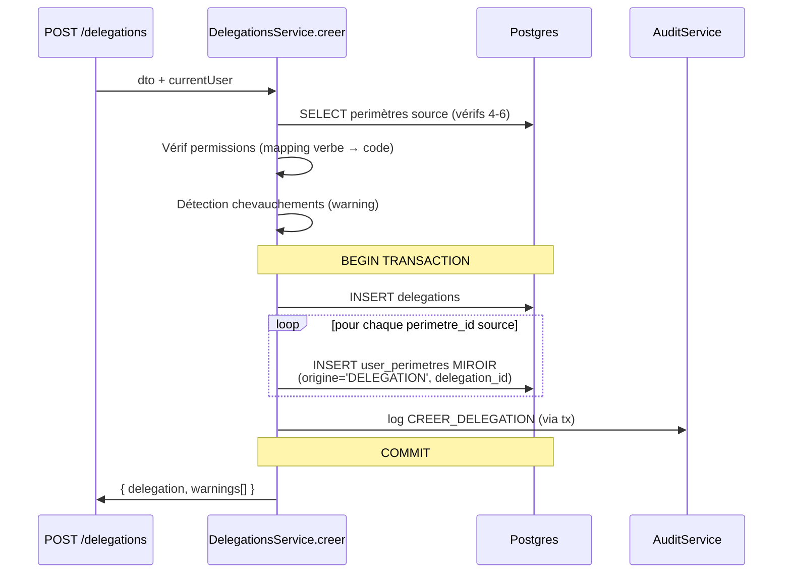

# Lot 4.2 — Délégations temporaires de droits

> Statut : **livré** (2026-05-04) — branche `lot-4/4.2-delegations`

## 1. Contexte et décisions produit

Le Lot 4.1 a posé les fondations multi-périmètres en figeant la
décision **D2 — anti-chaînage strict** (cf.
[`4.1-multi-perimetres.md`](./4.1-multi-perimetres.md)). Le Lot 4.2
implémente la fonctionnalité métier : un délégant `D` accorde à un
délégataire `R` la possibilité d'effectuer certaines actions
(`SAISIE` / `SOUMISSION` / `VALIDATION` / `PUBLICATION`) sur un
sous-ensemble de ses `user_perimetres`, pour une période bornée.

Décisions produit (figées avant Lot 4.2) :

| Décision | Choix retenu | Conséquence |
|----------|--------------|-------------|
| **D2 (rappel)** — anti-chaînage | **STRICT** (NON NÉGOCIABLE) | Une permission reçue par délégation ne peut PAS être re-déléguée. Vérifié côté service via `user_perimetres.origine='DELEGATION'`. Auditabilité BCEAO. |
| **D2-bis** — révocation | délégant ou ADMIN (`DELEGATION.GERER`) | Endpoint `POST /delegations/:id/revoquer` |
| **D2-ter** — expiration | automatique via cron quotidien (02:00 UTC) + catch-up au démarrage | Cron @nestjs/schedule |
| **D2-quater** — effets de bord | miroirs `user_perimetres` créés/désactivés en transaction atomique avec audit | Une délégation = N lignes miroir (origine='DELEGATION', delegation_id renseigné) |

## 2. Modèle de données

### 2.1 Nouvelle table `delegations`

Migration : `1779200000120-CreerTableDelegations.ts`.

| Colonne | Type | Notes |
|---------|------|-------|
| `id` | bigint PK identity | |
| `fk_delegant` | bigint NOT NULL | FK `user(id)` ON DELETE RESTRICT |
| `fk_delegataire` | bigint NOT NULL | FK `user(id)` ON DELETE RESTRICT |
| `perimetre_user_perimetre_ids` | bigint[] NOT NULL | IDs des `user_perimetres` du délégant inclus |
| `permissions` | text[] NOT NULL | sous-ensemble de `{SAISIE, SOUMISSION, VALIDATION, PUBLICATION}` |
| `motif` | text NOT NULL | obligatoire pour traçabilité |
| `date_debut` | date NOT NULL | |
| `date_fin` | date NOT NULL | inclusif |
| `actif` | boolean NOT NULL DEFAULT true | soft via `false` (révocation ou expiration) |
| `revoquee_le` | timestamp NULL | NULL si pas révoquée explicitement |
| `fk_revoque_par` | bigint NULL | FK `user(id)` ON DELETE SET NULL |
| `motif_revocation` | text NULL | |

### 2.2 Contraintes CHECK

- `chk_delegation_diff_users` : `fk_delegant <> fk_delegataire`
- `chk_delegation_dates` : `date_fin >= date_debut`
- `chk_delegation_perimetres_non_vide` : `array_length(perimetre_user_perimetre_ids, 1) >= 1`
- `chk_delegation_permissions_valides` : `permissions <@ ARRAY['SAISIE','SOUMISSION','VALIDATION','PUBLICATION']` AND non vide

### 2.3 Index

- `idx_delegations_delegant_actif (fk_delegant, actif)`
- `idx_delegations_delegataire_actif (fk_delegataire, actif)`
- `idx_delegations_dates (date_debut, date_fin) WHERE actif = true`

### 2.4 FK `user_perimetres.delegation_id` enfin posée

La colonne avait été créée (NULL) au Lot 4.1.A pour préparer le
Lot 4.2. La migration 4.2 pose la contrainte référentielle
`fk_user_perimetres_delegation` (information_schema vérifié — idempotent).

## 3. Permissions

Deux nouvelles permissions sont créées :

| Code | Module | Attribuée à |
|------|--------|-------------|
| `DELEGATION.LIRE` | DELEGATION | ADMIN, LECTEUR, SAISISSEUR, VALIDATEUR, PUBLICATEUR, AUDITEUR |
| `DELEGATION.GERER` | DELEGATION | ADMIN uniquement (révocation tierce + vue admin globale) |

La création reste accessible à tout user authentifié pour ses
propres délégations — c'est la lecture/listing qui requiert
`DELEGATION.LIRE` (cf. décision API ci-dessous).

## 4. Service applicatif (`DelegationsService`)

### 4.1 Règles métier vérifiées à la création

1. **Délégant ≠ délégataire** (BadRequest)
2. **Délégataire actif** (BadRequest)
3. **`date_fin >= date_debut`** (BadRequest)
4. **Inclusion permissions** : le délégant possède la permission
   RBAC sous-jacente (mapping `SAISIE→BUDGET.SAISIR`,
   `SOUMISSION→BUDGET.SOUMETTRE`, `VALIDATION→BUDGET.VALIDER`,
   `PUBLICATION→BUDGET.PUBLIER`) — sinon BadRequest avec message
   précis sur la permission manquante.
5. **Inclusion périmètre** : tous les `perimetre_user_perimetre_ids`
   appartiennent au délégant et sont actifs / dans la fenêtre temporelle
   (BadRequest sinon).
6. **🔴 ANTI-CHAÎNAGE STRICT (D2)** : si l'un des périmètres source
   a `origine='DELEGATION'`, REJETER avec message clair sur la
   non-négociabilité (auditabilité BCEAO).
7. **Chevauchement** (informatif) : si une délégation active
   identique (même couple, perm partagée, périmètre partagé,
   chevauchement temporel) existe → warning remonté, pas blocage.

### 4.2 Effets de bord à la création (transaction atomique)

### 4.3 Révocation

`POST /delegations/:id/revoquer`

- Autorisation : **délégant** OU **ADMIN** (`DELEGATION.GERER`).
  Tout autre user → 403.
- Effets en transaction atomique :
  - `delegations.actif=false` + `revoquee_le=NOW()` + `motif_revocation`
  - `user_perimetres WHERE delegation_id=X` → `actif=false`
  - audit `REVOQUER_DELEGATION`

### 4.4 Expiration automatique (cron)

`@Cron('0 2 * * *')` + `OnApplicationBootstrap` (catch-up démarrage).

Toutes les `delegations WHERE actif=true AND date_fin < CURRENT_DATE`
sont désactivées en boucle, chaque ligne dans sa propre transaction
avec :
- `delegations.actif=false`, `utilisateur_modification='system (cron expiration)'`
- miroirs `user_perimetres` désactivés
- audit `EXPIRER_DELEGATION` (utilisateur `'system'`)

### 4.5 Extension `PermissionsService`

Nouvelle méthode `getPermissionsEffectivesAvecContexte(userId, dateRef?)` :

Retourne `EffectivePermissionWithContext[]` — chaque permission est
annotée d'un champ `via: 'NATIF' | 'DELEGATION'` et, si déléguée,
de `delegation_id`. Le service requête la table `delegations`
directement via raw SQL pour éviter une dépendance cyclique vers
`DelegationsService`.

Utilisée par :
- l'API frontend pour afficher les badges « via délégation »
- l'audit applicatif pour propager `via_delegation_id` lors des
  actions métier (champ déjà prévu dans le payload audit).

## 5. API REST

| Méthode | Route | Permission | Usage |
|---------|-------|------------|-------|
| POST | `/delegations` | (auth) | Créer (délégant = user courant) |
| POST | `/delegations/:id/revoquer` | délégant ou `DELEGATION.GERER` | Révoquer |
| GET | `/delegations/recues` | (auth) | Mes délégations reçues |
| GET | `/delegations/emises` | (auth) | Mes délégations émises |
| GET | `/admin/delegations` | `DELEGATION.GERER` | Vue admin globale |

Chaque réponse `DelegationResponseDto` calcule un statut côté
serveur (`ACTIVE` / `REVOQUEE` / `EXPIREE`) à partir de
`actif`, `revoquee_le`, `date_fin` vs `CURRENT_DATE`.

## 6. UI (frontend)

- **Page `Mes délégations`** (`/mes-delegations`) — entrée sidebar
  pour tout user authentifié. 2 onglets :
  - *Reçues* : read-only
  - *Émises* : avec bouton « Révoquer » (sur les actives uniquement)
  Bouton « Nouvelle délégation » global → `CreerDelegationDialog`.
- **`CreerDelegationDialog`** — sélection délégataire ≠ moi,
  périmètres natifs uniquement (anti-chaînage UI), 4 verbes,
  dates, motif.
- **`RevoquerDelegationDialog`** — confirmation + motif obligatoire.
- **Page `/admin/delegations`** — entrée Administration sidebar,
  permission `DELEGATION.GERER` requise. Vue de toutes les
  délégations avec filtre statut + bouton révocation tierce.

## 7. Tests

- **Backend** : 39 tests Lot 4.2 (≥ 35 requis)
  - `DelegationsService.spec.ts` : 25 tests (création + rejets +
    anti-chaînage + révocation + expiration + getPermissionsRecues)
  - `PermissionsService.spec.ts` : 5 nouveaux tests (extension contexte)
  - `DelegationsController.spec.ts` : 9 tests (routage, autorisation
    admin, sérialisation, propagation warnings)
  - **0 régression** sur les 834 tests Lot 1-4.1 préexistants.
- **Frontend** : 25 tests Lot 4.2 (≥ 14 requis)
  - `delegations.test.ts` (API client) : 5
  - `RevoquerDelegationDialog.test.tsx` : 3
  - `CreerDelegationDialog.test.tsx` : 5
  - `MesDelegationsPage.test.tsx` : 7
  - `AdminDelegationsPage.test.tsx` : 5
  - **0 régression** sur les 373 tests préexistants.

## 8. Smoke test (scénario clé Q→T anti-chaînage)

Personas (Lot 4.1-fix3) :
- Amadou (`adj.retail@miznas.local`) — SAISISSEUR avec affectation CR
- Aïcha (`dir.retail@miznas.local`) — VALIDATEUR avec affectation Structure
- Ibrahim (`dir.corporate@miznas.local`) — VALIDATEUR

Scénario :
1. Amadou crée une délégation à Aïcha sur son CR (perm SAISIE,
   30 jours) → ✅ création + 1 miroir `user_perimetres` chez Aïcha
   avec `origine='DELEGATION'`.
2. Aïcha tente de re-déléguer à Ibrahim ce même périmètre miroir
   (perm SAISIE, 15 jours) → 🔴 **REJET 400 BadRequest** avec
   message :
   > *« Vous ne pouvez pas déléguer une permission que vous tenez
   > vous-même d'une délégation. La chaîne de délégation est
   > interdite (auditabilité BCEAO). Demandez à un administrateur
   > de réassigner directement. »*
3. Aïcha peut, en revanche, déléguer ses propres affectations
   natives (origine `AFFECTATION` / `PRINCIPAL`) à Ibrahim → ✅
4. Aïcha (ou un admin) révoque la délégation reçue d'Amadou
   → miroir `user_perimetres` désactivé immédiatement, audit
   `REVOQUER_DELEGATION` enregistré.
5. Le cron quotidien désactive automatiquement la délégation
   d'Aïcha vers Ibrahim une fois `date_fin` dépassée → audit
   `EXPIRER_DELEGATION`.

Ce scénario est couvert par les tests automatisés
(`DelegationsService.spec.ts` — test « ANTI-CHAÎNAGE STRICT »).
