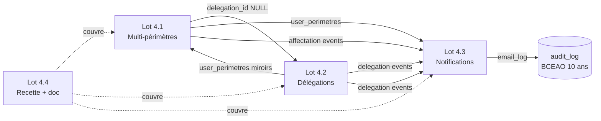
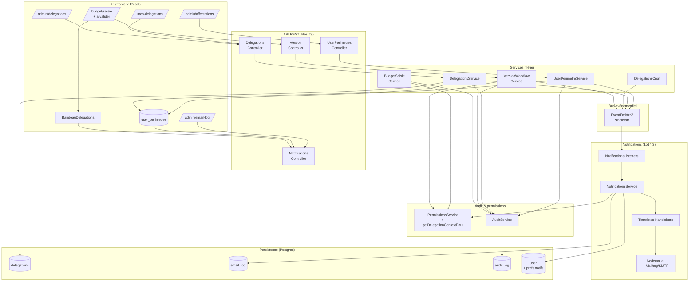

# Lot 4 — Synthèse

> Statut : **livré** (mai 2026)
>
> Le Lot 4 ferme le module budgétaire MIZNAS en lui donnant ses
> trois capacités transverses : périmètres flexibles, délégations
> de droits temporaires et notifications email automatisées.

## 1. Vue d'ensemble

Le Lot 4 est composé de 4 sous-lots interdépendants :

| Sous-lot | Périmètre | Doc détaillée |
|----------|-----------|---------------|
| **4.1** + 4.1-fix1/2/3 | Affectations multi-périmètres (`STRUCTURE`/`CR`/`CR_SET`), 6 personas BSIC, 4 rôles métier (SAISISSEUR/VALIDATEUR/PUBLICATEUR/AUDITEUR), audit transactionnel, anti-doublons CR_SET | [`4.1-multi-perimetres.md`](./4.1-multi-perimetres.md) |
| **4.2** + 4.2-fix1/3 | Délégations temporaires (anti-chaînage strict D2 BCEAO), cron expiration quotidien, `via_delegation_id` câblé sur 6 actions métier, indicateur UI bandeau délégations | [`4.2-delegations.md`](./4.2-delegations.md) |
| **4.3** | 8 événements email (E1-E5, E7-E9 ; E6 reporté Lot 6), templates Handlebars, dry-run, retry 1s/3s/10s, préférences user (toggle global + liste blanche), pages admin email-log + user `/me/preferences` | [`4.3-notifications-email.md`](./4.3-notifications-email.md) |
| **4.4** | Recette transverse R1→R7 + doc consolidée + grille de suivi | [`recette.md`](./recette.md) + ce document |

## 2. Architecture haut niveau

**Couplage faible** : les services métier émettent des événements
typés via `EventEmitter2` et oublient. Les listeners du
`NotificationsModule` les captent en async ; un échec d'envoi ne
remonte JAMAIS vers l'action métier déjà committée.

## 3. Migrations (047 → 052)

> Numérotation Lot 4 (47 → 52) — fichiers physiques avec
> horodatage `1779200000xxx`. La base contient désormais **52
> migrations** au total dont 6 pour le Lot 4.

| # | Fichier | Contenu | Sous-lot |
|---|---------|---------|----------|
| **047** | `1779200000080-AjoutUserPerimetres.ts` | Table `user_perimetres` (cible_type STRUCTURE/CR/CR_SET, origine PRINCIPAL/AFFECTATION/DELEGATION, `delegation_id` NULL pré-câblé, contraintes CHECK cohérence, backfill depuis `bridge_user_role`, 4 index dont GIN sur `cible_cr_ids`). | 4.1 |
| **048** | `1779200000090-AjouterPersonasBSIC.ts` | Seed des 6 personas BSIC Niger (Amadou, Aïcha, Ibrahim, Fatima, contrôleur, auditeur) avec mot de passe initial et rôle générique LECTEUR. | 4.1-fix |
| **049** | `1779200000100-Lot41Fix2DataPatches.ts` | Index unique partial `uq_user_perimetres_cr_set_actif` (anti-doublons CR_SET) + 5 codes audit `CREER_AFFECTATION`/`RETIRER_AFFECTATION`/`CREER_DELEGATION`/`REVOQUER_DELEGATION`/`EXPIRER_DELEGATION` ajoutés à `ref_type_action_audit`. | 4.1-fix2 |
| **050** | `1779200000110-CreerRolesMetierEtBasculePersonasBSIC.ts` | Création des 4 rôles métier (SAISISSEUR/VALIDATEUR/PUBLICATEUR/AUDITEUR) avec leurs permissions BUDGET.* + bascule des 6 personas BSIC vers leurs rôles différenciés (3 VALIDATEUR, 1 SAISISSEUR, 1 PUBLICATEUR, 1 AUDITEUR). | 4.1-fix3 |
| **051** | `1779200000120-CreerTableDelegations.ts` | Table `delegations` (4 contraintes CHECK : diff_users, dates, périmètres non vide, permissions valides ; 3 index) + permissions `DELEGATION.LIRE`/`DELEGATION.GERER` + FK `fk_user_perimetres_delegation` enfin posée (la colonne avait été créée NULL au 047 pour préparer ce sous-lot). | 4.2 |
| **052** | `1779200000130-CreerEmailLogEtPreferencesNotifications.ts` | Table `email_log` (statut enum 4 valeurs CHECK, payload jsonb, 3 index) + extension `"user"` avec 2 colonnes `notifications_email_actives` BOOLEAN DEFAULT true et `notifications_email_types` TEXT[] DEFAULT NULL. | 4.3 |

Toutes idempotentes (CREATE TABLE/COLUMN IF NOT EXISTS, ON
CONFLICT DO NOTHING, INSERT WHERE NOT EXISTS, ADD CONSTRAINT
conditionnel via information_schema).

## 4. Permissions ajoutées au RBAC

### 4.1 Permissions de référence (`ref_permission`)

| Code | Module | Description | Sous-lot |
|------|--------|-------------|----------|
| `DELEGATION.LIRE` | DELEGATION | Lister ses propres délégations (en tant que délégant ou délégataire). | 4.2 |
| `DELEGATION.GERER` | DELEGATION | Vue admin globale + révoquer une délégation tierce. | 4.2 |

### 4.2 Rôles métier (`ref_role`)

Migration 050 a créé 4 rôles métier qui n'existaient pas avant le
Lot 4 (où les personas BSIC partageaient tous le rôle générique
`LECTEUR`).

| Rôle | Permissions | Persona type |
|------|-------------|--------------|
| `SAISISSEUR` | `REFERENTIEL.LIRE`, `BUDGET.LIRE`, `BUDGET.SAISIR`, `DELEGATION.LIRE` | Amadou (`adj.retail`) |
| `VALIDATEUR` | tout SAISISSEUR + `BUDGET.SOUMETTRE`, `BUDGET.VALIDER` | Aïcha (`dir.retail`), Ibrahim (`dir.corporate`), Contrôleur de gestion |
| `PUBLICATEUR` | tout VALIDATEUR + `BUDGET.PUBLIER` | Fatima (`dga.exploitation`) |
| `AUDITEUR` | `REFERENTIEL.LIRE`, `BUDGET.LIRE`, `AUDIT.LIRE`, `DELEGATION.LIRE` | `auditeur@miznas.local` |

ADMIN reçoit toutes les permissions y compris les 2 nouvelles.

## 5. Codes audit ajoutés au journal applicatif

5 codes structurels pour les actions de gestion (Lot 4.1 + 4.2),
auditables BCEAO 10 ans :

| Code | Émetteur | Lot |
|------|----------|-----|
| `CREER_AFFECTATION` | `UserPerimetreService.creer` | 4.1 |
| `RETIRER_AFFECTATION` | `UserPerimetreService.retirer` | 4.1 |
| `CREER_DELEGATION` | `DelegationsService.creer` | 4.2 |
| `REVOQUER_DELEGATION` | `DelegationsService.revoquer` | 4.2 |
| `EXPIRER_DELEGATION` | `DelegationsService.expirerAutomatiquement` (cron, utilisateur=`system`) | 4.2 |

### 5.1 `via_delegation_id` (Lot 4.2-fix.A)

Sur les 6 actions métier suivantes, lorsqu'elles sont exécutées
via une permission obtenue par délégation, le `payload_apres` de
l'`audit_log` contient `via_delegation_id` (snake_case, cohérent
avec la convention SQL audit BCEAO) :

`SOUMETTRE_BUDGET`, `VALIDER_BUDGET`, `REJETER_BUDGET`,
`PUBLIER_BUDGET`, `IMPORT_BUDGET`, `IMPORT_BUDGET_BULK`.

**Priorité NATIF** : si l'utilisateur possède la permission à la
fois nativement et par délégation, `via_delegation_id` est OMIS.
Implémenté dans `PermissionsService.getDelegationContextPour`.

## 6. Codes événement email (`email_log.evenement`)

8 événements fonctionnels (Lot 4.3) — E6 (rappel délégation J-3)
explicitement reporté en Lot 6.

| Code | Déclencheur | Destinataires |
|------|-------------|---------------|
| `BUDGET_SOUMIS` (E1) | `VersionWorkflowService.soumettre` | Users avec `BUDGET.VALIDER` (hors auteur) |
| `BUDGET_VALIDE` (E2) | `VersionWorkflowService.valider` | Soumetteur (audit lookup) + users `BUDGET.PUBLIER` |
| `BUDGET_REJETE` (E3) | `VersionWorkflowService.rejeter` | Soumetteur uniquement (motif dans payload) |
| `BUDGET_PUBLIE` (E4) | `VersionWorkflowService.publier` | Soumetteur + validateur + saisisseurs concernés |
| `DELEGATION_CREEE` (E5) | `DelegationsService.creer` | Délégataire |
| `DELEGATION_EXPIREE` (E7) | `DelegationsService.expirerAutomatiquement` (cron) | Délégant + délégataire |
| `DELEGATION_REVOQUEE` (E8) | `DelegationsService.revoquer` | Délégataire |
| `AFFECTATION_CREEE` (E9) | `UserPerimetreService.creer` | User affecté |

Chaque envoi (réel, dry-run, supprimé par préférence) génère 1
ligne `email_log` — **traçabilité systématique** (audit BCEAO).

## 7. Métriques globales Lot 4

| Métrique | Valeur |
|----------|--------|
| Sous-lots livrés | 4 (4.1, 4.2, 4.3, 4.4) + 5 mini-fix |
| Migrations Lot 4 | 6 (047 → 052) |
| Permissions RBAC ajoutées | 2 (`DELEGATION.LIRE/GERER`) + 4 rôles métier |
| Codes audit ajoutés | 5 (3 délégations + 2 affectations) + extension `via_delegation_id` sur 6 actions métier |
| Codes événement email | 8 (E1-E5, E7-E9 ; E6 reporté Lot 6) |
| Templates Handlebars | 8 + 1 layout |
| Tests automatisés ajoutés Lot 4 | ~165 (multi-périmètres + délégations + notifications) |
| Tests totaux MIZNAS | **918 backend + 414 frontend = 1332** verts, 0 régression cumulée depuis Lot 1 |
| Endpoints REST ajoutés | ~12 (admin/affectations, delegations, admin/delegations, admin/email-log, me/preferences-notifications) |
| Pages frontend ajoutées | 5 (admin/affectations, mes-delegations, admin/delegations, admin/email-log, me/preferences) |
| Personas BSIC livrés | 8 (admin + lecteur + 6 personas métier) |

## 8. Documents associés

- [`4.1-multi-perimetres.md`](./4.1-multi-perimetres.md) — modèle
  `user_perimetres`, contraintes, backfill `bridge_user_role`,
  service applicatif, dette résolue Lot 4.1-fix1/2/3.
- [`4.2-delegations.md`](./4.2-delegations.md) — table
  `delegations`, anti-chaînage strict, cron expiration, API REST
  + UI, scénario Q→T smoke test.
- [`4.3-notifications-email.md`](./4.3-notifications-email.md) —
  infrastructure mailer + EventEmitter, 8 templates, retry,
  dry-run, préférences user, dette tracée Lot 6 (BullMQ, E6 J-3,
  i18n, preview admin).
- [`recette.md`](./recette.md) — 7 scénarios de recette
  bout-en-bout R1→R7 avec étapes UI, vérifications SQL et cas
  négatifs.
- [`sequences.md`](./sequences.md) — diagrammes mermaid des 4
  flux principaux.
- [`/CHANGELOG.md`](../../CHANGELOG.md) — entrée Lot 4
  consolidée.

## 9. Dette consolidée vers Lot 6

Reportée explicitement (cf. mandats individuels et sections §10
des docs détaillées) :

- **E6 rappel délégation J-3** — cron quotidien dédié + suivi
  d'envois (anti-doublon par jour) ; reporté Lot 6 [4.3].
- **Migration retry email vers BullMQ + Redis** — éviter le retry
  synchrone qui peut bloquer la requête HTTP en cas d'échec SMTP
  transitoire (jusqu'à 14 s) ; reporté Lot 6 [4.3].
- **Outbox pattern post-commit** — si l'app crash entre le COMMIT
  et l'`events.emit()`, l'email n'est jamais envoyé ; reporté
  Lot 6 [4.3].
- **Internationalisation templates email** — actuellement français
  uniquement ; à prévoir si déploiement hors UEMOA [4.3].
- **Preview HTML admin** d'un email déjà envoyé (rendre le template
  avec son payload pour vérification visuelle) [4.3].
- **Cookie de désinscription en 1 clic** dans le pied de page,
  alternative à `/me/preferences` [4.3].
- **Autocomplete avec recherche serveur** dans
  `CreerDelegationDialog` — la liste paginée fixe limit=100 ne
  scalera pas pour des banques avec >100 users actifs [4.2-fix3].
- **UI gestion des rôles** — admin n'a pas de page web pour
  attribuer/retirer un rôle ; passe pour l'instant par les seeds
  ou des UPDATE SQL directs [4.1-fix3].
