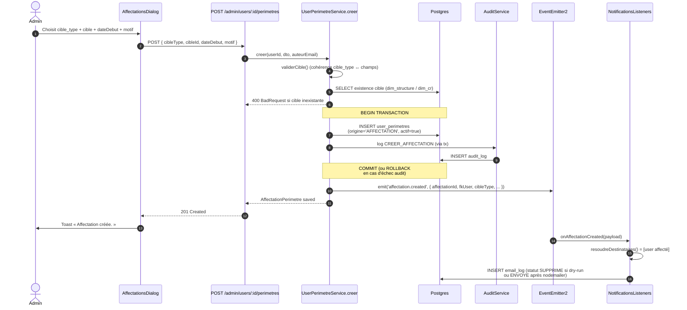
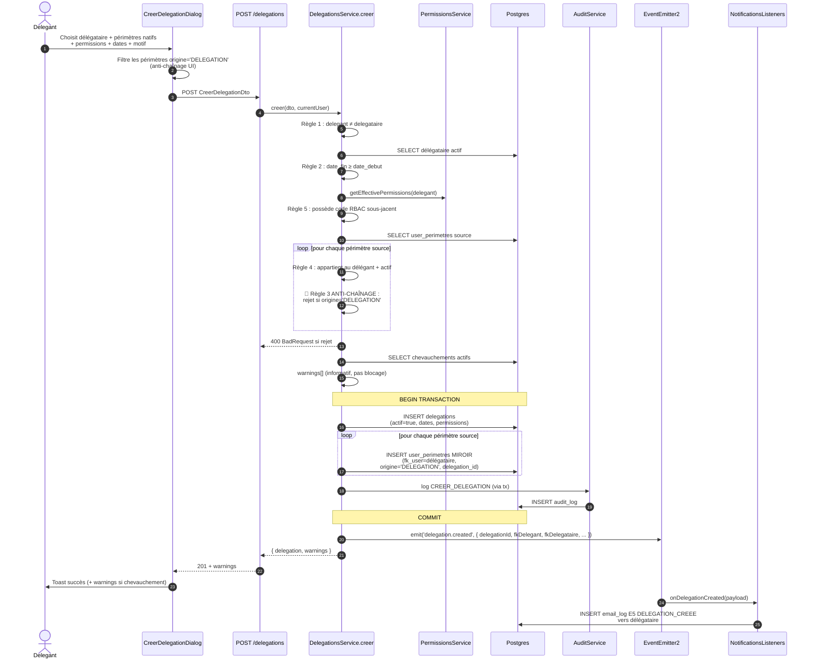
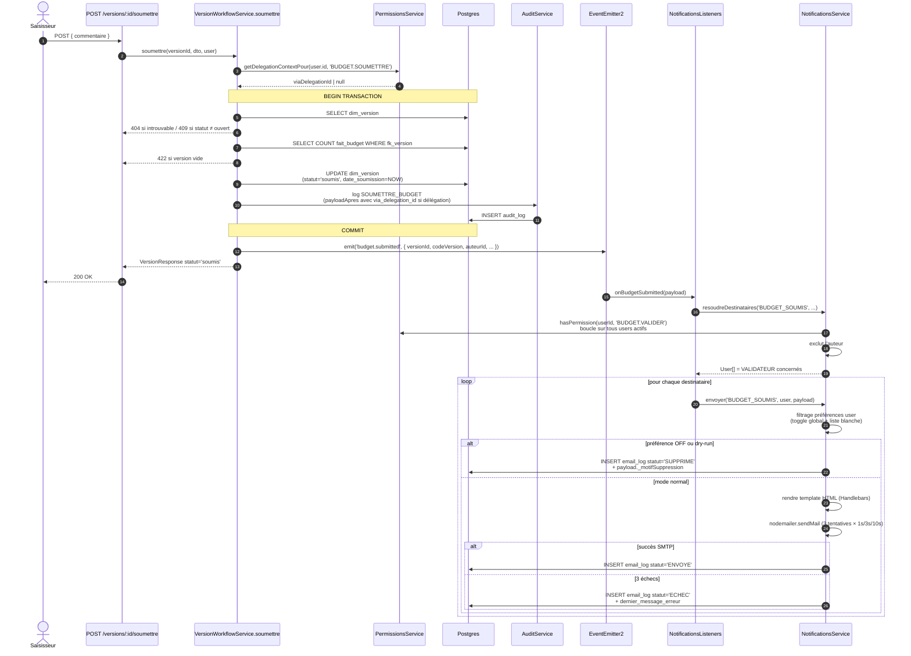
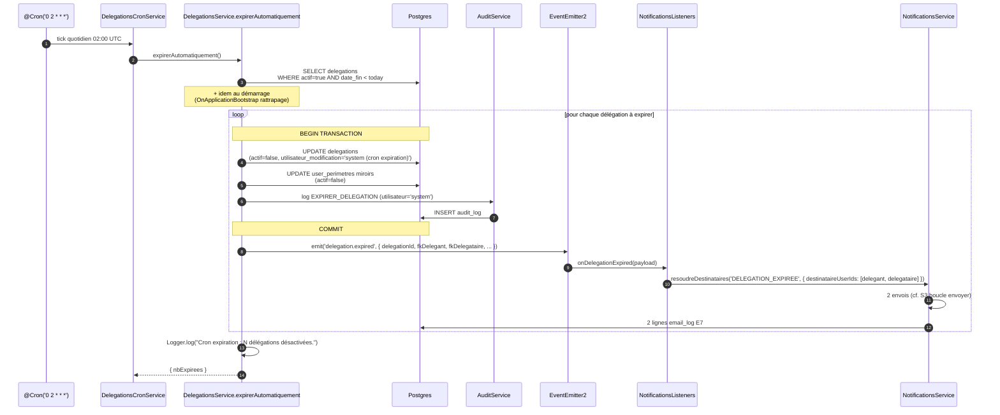

# Lot 4 — Diagrammes de séquence

> Vue dynamique des 4 flux principaux du Lot 4. Complément à
> [`README.md`](./README.md) (vue statique) et à [`recette.md`](./recette.md)
> (validation E2E).

## S1 — Création d'une affectation multi-périmètres (Lot 4.1)

Admin attribue un périmètre `STRUCTURE` / `CR` / `CR_SET` à un
utilisateur. Tout est transactionnel : si l'audit échoue,
l'affectation est rollback. L'événement `affectation.created`
est émis post-commit pour notifier l'utilisateur.

**Points clés** :
- Validation avant écriture : `validerCible` refuse les
  combinaisons inconsistantes (`CR_SET` sans `cible_cr_ids` ≥ 2,
  `STRUCTURE` avec `cible_cr_ids`, etc.).
- Index unique partial `uq_user_perimetres_actif` (Lot 4.1-fix2.C)
  protège contre les doublons (`cible_type`, `cible_id`,
  `origine`) → 409 Conflict côté API.
- Index unique partial `uq_user_perimetres_cr_set_actif` empêche
  2 `CR_SET` strictement identiques actifs pour le même user.
- L'événement `affectation.created` produit l'email E9
  (`AFFECTATION_CREEE`) vers le user affecté.

---

## S2 — Création d'une délégation (Lot 4.2)

Délégant accorde une délégation à un délégataire. Les **miroirs
`user_perimetres`** sont créés en transaction atomique avec
l'audit `CREER_DELEGATION`. **Anti-chaînage strict (D2 BCEAO)**
vérifié avant écriture.

**Points clés** :
- L'anti-chaînage est appliqué **2 fois** : côté UI (filtrage des
  périmètres `origine='DELEGATION'`) ET côté API (rejet dur avec
  message BCEAO explicite si tentative bypass).
- Les miroirs `user_perimetres` sont créés *dans la même
  transaction* que la `delegations` row + l'audit. Tout-ou-rien.
- Chevauchements (couple delegant/delegataire/permission/dates
  qui se recouvrent) → warnings remontés, pas blocage.
- L'événement post-commit déclenche l'email E5
  (`DELEGATION_CREEE`) vers le délégataire avec rappel
  anti-chaînage dans le template.

---

## S3 — Soumission d'une version → notification aux validateurs (Lot 3.5 + 4.3)

Workflow `ouvert → soumis`. Au commit, un événement est émis et
tous les VALIDATEUR concernés par le périmètre reçoivent un email
E1 (`BUDGET_SOUMIS`).

**Points clés** :
- Le `getDelegationContextPour` est appelé AVANT la transaction
  pour ne pas allonger le verrou — le résultat est juste injecté
  dans le payload audit.
- L'événement est émis APRÈS le COMMIT — si la transaction
  échoue, aucun email n'est émis.
- Un échec d'envoi (catch dans le listener) ne remonte JAMAIS
  vers l'action métier déjà committée.
- Le filtrage préférences produit toujours une trace `email_log`
  (statut `SUPPRIME` + motif) — exigence audit BCEAO.

---

## S4 — Cron expiration délégation (Lot 4.2 + 4.3)

Tous les jours à 02:00 UTC, le scheduler désactive les délégations
dont `date_fin < CURRENT_DATE` et émet l'email E7
(`DELEGATION_EXPIREE`) au délégant et au délégataire.

**Points clés** :
- Une transaction par délégation (granularité du rollback) plutôt
  qu'une transaction globale — un échec sur une délégation
  n'arrête pas le traitement des autres.
- `OnApplicationBootstrap` permet un rattrapage si l'app était
  down au moment du cron normal.
- Le filtre est strict `<` (pas `<=`) : une délégation
  `date_fin = today` reste active pour la journée en cours.
- Aucun email n'est envoyé pour une délégation déjà
  `actif=false` (révoquée explicitement avant son terme — l'email
  `REVOQUER_DELEGATION` a déjà été émis à ce moment-là).
