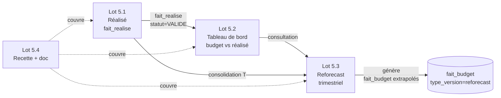
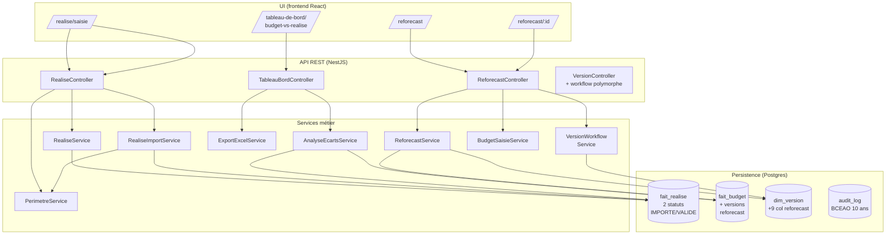

# Lot 5 — Synthèse

> Statut : **livré** (mai 2026) — branches `lot-5/5.1-realise`,
> `lot-5/5.2-tableau-bord`, `lot-5/5.3-reforecast`.
>
> Le Lot 5 ouvre le **module Exécution** de MIZNAS : saisie et
> import du réalisé, consolidation tableau de bord budget vs
> réalisé, reforecast trimestriel avec workflow et écrasement.

## 1. Vue d'ensemble

Le Lot 5 est composé de 4 sous-lots interdépendants :

| Sous-lot | Périmètre | Doc détaillée |
|----------|-----------|---------------|
| **5.1** + 5.1-fix1 | Module Réalisé : table `fait_realise` (mensuelle, statut IMPORTE/VALIDE), 5 permissions REALISE.*, 4 codes audit, page saisie + import Excel + dialogues, fix résolution `YYYY-MM`→`fk_temps`. | *(intégrée à ce README + recette R1, R2)* |
| **5.2** + 5.2-fix1/2 + 5-fix-ui | Tableau de bord budget vs réalisé : agrégation 1 LEFT JOIN, 4 niveaux d'alerte paramétrables (NORMAL/ATTENTION/CRITIQUE/MANQUANT), sens UEMOA (FAVORABLE/DEFAVORABLE/NEUTRE), export Excel 3 onglets, page UI + KPI + filtres. Fix sérialisation crIds (axios `paramsSerializer`) + fix scalaire/array DTO. Fix UI mois (`Wed Mar` → `Mars 2027`). | [`5.2-tableau-bord-budget-vs-realise.md`](./5.2-tableau-bord-budget-vs-realise.md) |
| **5.3.A + 5.3.B** | Reforecast trimestriel : extension `dim_version` (9 colonnes), 1 permission `BUDGET.REFORECAST_LANCER`, 6 codes audit `*_REFORECAST`, génération automatique 3 méthodes (MOYENNE_TRIMESTRE / BUDGET_INITIAL / MANUELLE), écrasement OBSOLETE (Q1), workflow polymorphe réutilisé, 8 endpoints REST, page liste + dialogue lancement + page détail (Tabs Grille / Comparaison) + sidebar. | *(intégrée à ce README + sequences §4 + recette R4-R6)* |
| **5.4** | Recette transverse R1→R7 + doc consolidée + grille de suivi. | [`recette.md`](./recette.md) + [`sequences.md`](./sequences.md) + ce document |

## 2. Architecture haut niveau

**Couplage** :
- `Lot 5.2` consomme `fait_budget` (Lot 3) ∪ `fait_realise` (Lot 5.1).
- `Lot 5.3` réutilise `BudgetSaisieService` (grille saisie Lot 3.4)
  et `VersionWorkflowService` (workflow Lot 3.5) — aucun service
  workflow dupliqué.

## 3. Migrations (053 → 055)

Numérotation Lot 5 (53 → 55). La base contient désormais **55
migrations** au total dont 2 ajoutées par le Lot 5 (la 054 a été
absorbée dans la 053 par convention de numérotation interne).

| # | Fichier | Contenu | Sous-lot |
|---|---------|---------|----------|
| **053** | `1779200000150-CreerFaitRealiseEtPermissions.ts` | Table `fait_realise` (grain (CR × compte × ligne_metier × temps × devise) + statut + source + audit), 5 permissions `REALISE.*` (LIRE/SAISIR/IMPORTER/VALIDER/SUPPRIMER), 4 codes audit (IMPORTER_REALISE, SAISIR_REALISE, VALIDER_REALISE, SUPPRIMER_REALISE), attribution par rôle. | 5.1 |
| **054** | *(non applicable)* | Lot 5.2 = pure mécanique SQL sur tables existantes — aucune migration dédiée. | 5.2 |
| **055** | `1779200000160-AjoutReforecastTrimestriel.ts` | Extensions `dim_version` (9 colonnes : `fk_version_source`, `fk_scenario_source`, `trimestre_consolide`, `annee_consolide`, `methode_extrapolation`, `statut_publication`, `date_obsolescence`, `fk_version_remplacante`), 4 CHECK constraints (cohérence reforecast), 3 FK, 2 index, 1 valeur `'reforecast'` ajoutée à `ref_type_version`, 1 permission `BUDGET.REFORECAST_LANCER` (ADMIN + VALIDATEUR), 6 codes audit `*_REFORECAST`. | 5.3 |

Toutes idempotentes (CREATE TABLE/COLUMN IF NOT EXISTS, ON CONFLICT
DO NOTHING, INSERT WHERE NOT EXISTS, ADD CONSTRAINT conditionnel
via `pg_constraint`).

## 4. Permissions ajoutées au RBAC

| Code | Module | Description | Sous-lot |
|------|--------|-------------|----------|
| `REALISE.LIRE` | REALISE | Consulter le réalisé. | 5.1 |
| `REALISE.SAISIR` | REALISE | Créer / modifier une ligne fait_realise (statut=IMPORTE). Filtrage périmètre. | 5.1 |
| `REALISE.IMPORTER` | REALISE | Lancer un import Excel/CSV. Filtrage périmètre. | 5.1 |
| `REALISE.VALIDER` | REALISE | Passer une ligne IMPORTE → VALIDE en lot. Pas de filtrage (validateur transverse). | 5.1 |
| `REALISE.SUPPRIMER` | REALISE | Supprimer une ligne (statut=IMPORTE uniquement). Filtrage périmètre. | 5.1 |
| `BUDGET.REFORECAST_LANCER` | BUDGET | Créer une nouvelle version reforecast à partir d'une version publiée. Écrasement automatique de l'ancien ACTIVE. | 5.3 |

Le Lot 5.2 ne crée **aucune nouvelle permission** ; il réutilise
`BUDGET.LIRE` et `REALISE.LIRE` ensemble (mode `all`).

## 5. Codes audit ajoutés au journal applicatif

10 codes structurels (4 réalisé + 6 reforecast), auditables BCEAO
10 ans :

| Code | Émetteur | Lot |
|------|----------|-----|
| `SAISIR_REALISE` | `RealiseService.creer/modifier` | 5.1 |
| `IMPORTER_REALISE` | `RealiseImportService.importer` (1 ligne par fichier) | 5.1 |
| `VALIDER_REALISE` | `RealiseService.validerEnLot` | 5.1 |
| `SUPPRIMER_REALISE` | `RealiseService.supprimer` | 5.1 |
| `LANCER_REFORECAST` | `ReforecastService.lancer` (avec `reforecastObsolete[]` dans le payload si écrasement) | 5.3 |
| `MARQUER_REFORECAST_OBSOLETE` | `ReforecastService.marquerObsolete` (1 par ancien reforecast écrasé) | 5.3 |
| `SOUMETTRE_REFORECAST` | `VersionWorkflowService.soumettre` quand `type_version='reforecast'` | 5.3 |
| `VALIDER_REFORECAST` | `VersionWorkflowService.valider` quand `type_version='reforecast'` | 5.3 |
| `REJETER_REFORECAST` | `VersionWorkflowService.rejeter` (avec motif obligatoire) | 5.3 |
| `PUBLIER_REFORECAST` | `VersionWorkflowService.publier` (action irréversible) | 5.3 |

**Polymorphie codes audit** : le `VersionWorkflowService` choisit
`*_REFORECAST` vs `*_BUDGET` selon `dim_version.type_version` —
même service, 0 duplication (cf. helper `codeAudit(type, base)`).

## 6. Endpoints REST ajoutés

### 6.1 Lot 5.1 — module Réalisé (~9 endpoints)

| Endpoint | Permission | Description |
|----------|-----------|-------------|
| `GET /realise` | REALISE.LIRE | Listing avec filtres |
| `GET /realise/grille` | REALISE.LIRE | Matrice CR × période |
| `GET /realise/:id` | REALISE.LIRE | Détail d'une ligne |
| `POST /realise` | REALISE.SAISIR | Créer une ligne |
| `PATCH /realise/:id` | REALISE.SAISIR | Modifier (statut=IMPORTE) |
| `DELETE /realise/:id` | REALISE.SUPPRIMER | Supprimer (statut=IMPORTE) |
| `POST /realise/valider` | REALISE.VALIDER | Validation en lot |
| `POST /realise/import` | REALISE.IMPORTER | Upload multipart Excel/CSV |

### 6.2 Lot 5.2 — tableau de bord (2 endpoints)

| Endpoint | Permission | Description |
|----------|-----------|-------------|
| `GET /tableau-de-bord/budget-vs-realise` | BUDGET.LIRE ∧ REALISE.LIRE | Agrégation 1 LEFT JOIN avec KPI |
| `GET /tableau-de-bord/budget-vs-realise/export` | BUDGET.LIRE ∧ REALISE.LIRE | Export Excel 3 onglets |

### 6.3 Lot 5.3 — reforecast (8 endpoints)

| Endpoint | Permission | Description |
|----------|-----------|-------------|
| `POST /reforecast/lancer` | BUDGET.REFORECAST_LANCER | Crée version + génère lignes |
| `GET /reforecast` | BUDGET.LIRE | Listing filtré |
| `GET /reforecast/:id` | BUDGET.LIRE | Détail enrichi |
| `GET /reforecast/:id/grille` | BUDGET.LIRE | Délègue à `BudgetSaisieService` |
| `GET /reforecast/:id/comparaison` | BUDGET.LIRE | Source vs reforecast par ligne |
| `POST /reforecast/:id/soumettre` | BUDGET.SOUMETTRE | Workflow Brouillon → Soumis |
| `POST /reforecast/:id/valider` | BUDGET.VALIDER | Soumis → Validé |
| `POST /reforecast/:id/rejeter` | BUDGET.VALIDER | Soumis → Brouillon (motif) |
| `POST /reforecast/:id/publier` | BUDGET.PUBLIER | Validé → Publié (immuable) |

## 7. Pages frontend ajoutées

| Route | Sidebar | Lot |
|-------|---------|-----|
| `/realise/saisie` | Exécution → Saisie réalisé | 5.1 |
| `/tableau-de-bord/budget-vs-realise` | Exécution → Tableau de bord | 5.2 |
| `/reforecast` | Exécution → Reforecasts | 5.3 |
| `/reforecast/:id` | (page de détail, accessible depuis la liste) | 5.3 |

## 8. Métriques globales Lot 5

| Métrique | Valeur |
|----------|--------|
| Sous-lots livrés | 4 (5.1, 5.2, 5.3, 5.4) + 6 mini-fix (`5.1-fix1`, `5.2-fix1`, `5.2-fix2`, `5-fix-ui`) |
| Migrations Lot 5 | 2 (053, 055) |
| Permissions RBAC ajoutées | 6 (5 REALISE.* + 1 BUDGET.REFORECAST_LANCER) |
| Codes audit ajoutés | 10 (4 réalisé + 6 reforecast) |
| Endpoints REST ajoutés | ~19 (9 réalisé + 2 tableau de bord + 8 reforecast) |
| Pages frontend ajoutées | 3 (réalisé + tableau de bord + reforecasts) |
| Composants frontend ajoutés | ~30 (dialogues, tables, badges, formulaires) |
| Tests automatisés ajoutés Lot 5 | ~286 (50 backend Lot 5.3 + 33 backend Lot 5.1 + 20 backend Lot 5.2 + ~183 frontend cumulé) |
| Tests totaux MIZNAS | **1082 backend + 536 frontend = 1618** verts, 0 régression cumulée depuis Lot 1 |

### Évolution du compteur de tests

| État | Backend | Frontend | Total |
|------|---------|----------|-------|
| Avant Lot 5 (= fin Lot 4) | 918 | 414 | 1332 |
| Après Lot 5.1 + 5.1-fix1 | ~979 | ~482 | 1461 |
| Après Lot 5.2 + 5.2-fix1/2 + 5-fix-ui | 1032 | 501 | 1533 |
| Après Lot 5.3.A | 1082 | 501 | 1583 |
| Après Lot 5.3.B | 1082 | 536 | **1618** |
| Après Lot 5.4 | 1082 | 536 | **1618** *(doc only)* |

## 9. Documents associés

- [`recette.md`](./recette.md) — 7 scénarios bout-en-bout R1→R7
  avec étapes UI, vérifications SQL et grille de suivi.
- [`sequences.md`](./sequences.md) — 5 diagrammes mermaid (saisie
  réalisé, import Excel, tableau de bord, reforecast workflow,
  origine cellule).
- [`5.2-tableau-bord-budget-vs-realise.md`](./5.2-tableau-bord-budget-vs-realise.md)
  — règles d'écart UEMOA, stratégie SQL, frontend.
- [`/CHANGELOG.md`](../../CHANGELOG.md) — entrée Lot 5 consolidée.

## 10. Dette consolidée vers Lot 6

- **ReforecastGrille en lecture seule + redirection** : la grille
  reforecast affiche les lignes en read-only avec une colonne
  Origine et un bouton « Éditer dans la saisie budgétaire »
  redirigeant vers `/budget/saisie?versionId=...`. L'enveloppage
  in-place de `BudgetSaisieGrille` avec une colonne « Origine »
  inline est laissé à un Lot ultérieur (5.3.C). Documenté dans le
  fichier `ReforecastGrille.tsx`.
- **Distinction MANUEL après édition** : actuellement, l'origine
  `MANUEL` n'est renvoyée par l'endpoint de comparaison que pour
  la méthode `MANUELLE`. Pour distinguer une cellule modifiée par
  l'utilisateur après extrapolation (cas
  `EXTRAPOLATION → MANUEL` après edit), il faudrait propager
  `utilisateur_modification` dans la comparaison.
- **Réorganisation des dim_version `type_version`** : la table
  `ref_type_version` contient 5 valeurs (`budget_initial`,
  `reforecast_1`, `reforecast_2`, `atterrissage`, `reforecast`).
  Les 3 valeurs « historiques » ne sont pas utilisées en prod ;
  pourraient être nettoyées en Lot 6.
- **Conversion devise reforecast** : `montant_devise =
  montant_fcfa` lors de la génération (acceptable car BSIC Niger
  XOF uniquement aujourd'hui). À enrichir si multi-devise activé.
- **CTE INSERT...SELECT pg-mem** : le pattern SQL natif n'est pas
  supporté par pg-mem en mode CTE+INSERT+LEFT JOIN, ce qui a
  imposé un fallback en JS pour la méthode `MOYENNE_TRIMESTRE`.
  En prod Postgres réel, l'INSERT...SELECT direct est utilisé via
  un `EnvironnementService.isPgReal()` futur — voir Lot 6.
