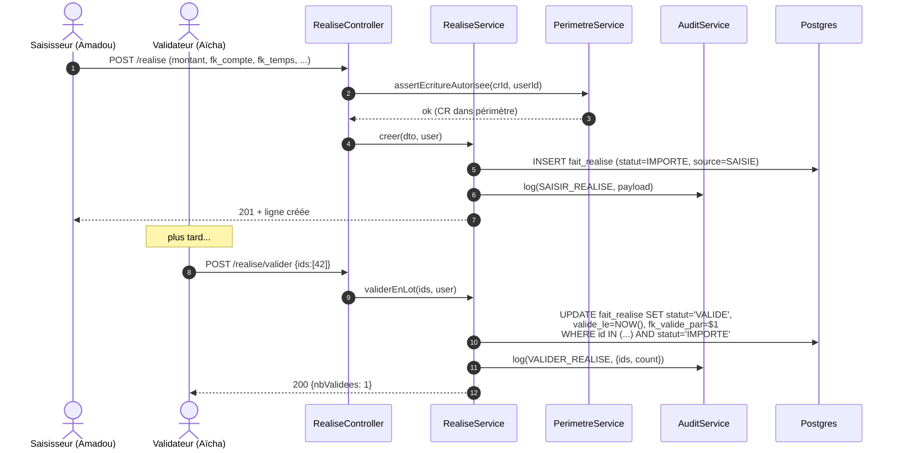
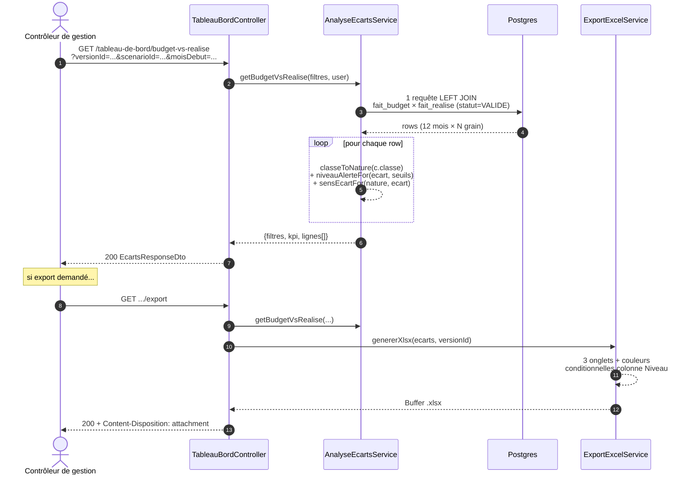
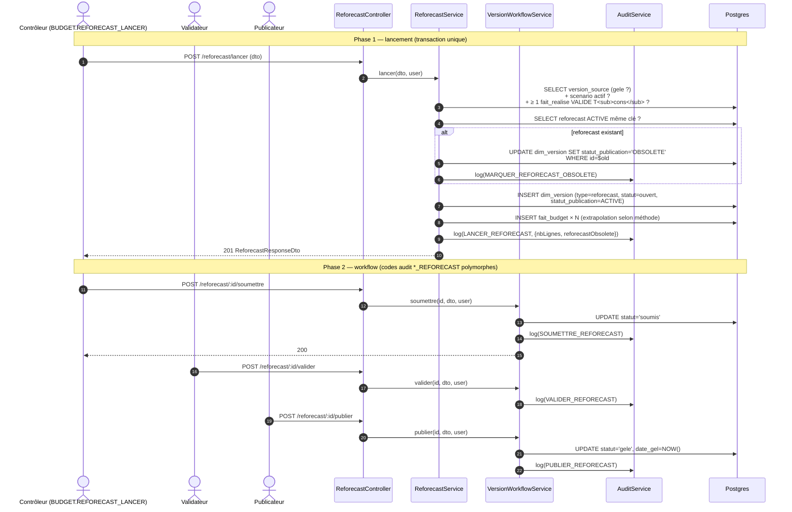

# Lot 5 — Diagrammes de séquence

> Compagnon visuel des 4 flux principaux du module **Exécution**.
> Tous les diagrammes sont en mermaid (rendus directement par
> GitHub).

## 1. Saisie + validation d'une ligne réalisé (Lot 5.1)

Cycle 2 statuts unidirectionnel `IMPORTE → VALIDE`.



**Points clés** :
- Filtrage périmètre **uniquement à l'écriture** (saisie + import) ;
  la lecture est transverse (cf. décision ADMIN.D).
- La validation n'est pas réversible (Q4 produit Lot 5.1) — pas de
  dévalidation, le seul moyen de corriger une ligne validée est de
  créer une nouvelle ligne avec `mode=CORRECTION`.

## 2. Import Excel/CSV de réalisé en lot (Lot 5.1.B)

```mermaid
sequenceDiagram
  autonumber
  actor SAI as Saisisseur
  participant FR as RealiseController
  participant IMP as RealiseImportService
  participant PAR as XlsxParser
  participant PER as PerimetreService
  participant AUD as AuditService
  participant DB as Postgres

  SAI->>FR: POST /realise/import (multipart .xlsx)
  FR->>IMP: importer(file, user)
  IMP->>PAR: parse(buffer)
  PAR-->>IMP: rows[] (50)
  loop pour chaque ligne
    IMP->>PER: assertEcritureAutorisee(crId, userId)
    alt CR autorisé
      IMP->>DB: INSERT fait_realise (source=IMPORT)
      IMP-->>IMP: rapport.nbCrees++
    else hors-périmètre / erreur DTO
      IMP-->>IMP: rapport.rejets.push({ligne, motif})
    end
  end
  IMP->>AUD: log(IMPORTER_REALISE, {nbCrees, nbRejets, fichier})
  IMP-->>SAI: 200 {rapport}
```

**Points clés** :
- 1 seule entrée audit par fichier (pas par ligne) — le rapport
  granulaire vit dans le payload.
- Les lignes invalides sont **ignorées** (pas de rollback global) ;
  l'utilisateur corrige et réimporte uniquement les rejetées.

## 3. Génération du tableau de bord budget vs réalisé (Lot 5.2)



**Points clés** :
- 1 seule passe SQL avec `LEFT JOIN` sur `fait_realise statut='VALIDE'`
  pour avoir les lignes `MANQUANT` (budget existe, pas de réalisé)
  sans 2e requête.
- Permission **double** `BUDGET.LIRE ∧ REALISE.LIRE` via
  `@RequirePermissions({ all: [...] })` (Lot 5.2-fix2).

## 4. Lancement reforecast trimestriel + workflow + écrasement (Lot 5.3)



**Points clés** :
- **Décision Q1 (écrasement)** : pas de chaînage de versions.
  L'ancien reforecast ACTIVE est marqué OBSOLETE de manière
  définitive ; aucune transition workflow n'est possible après.
- **Décision Q2 (réutilisation)** : pas de table `fait_reforecast`,
  on réutilise `dim_version type='reforecast'` + `fait_budget`.
- **Codes audit polymorphes** : `VersionWorkflowService` détecte
  `type_version='reforecast'` et émet `*_REFORECAST` à la place de
  `*_BUDGET` (1 service partagé, 0 duplication).

## 5. Origine d'une ligne fait_budget reforecast

Synthèse côté UI : la grille affiche un badge sur chaque cellule.

```mermaid
flowchart LR
  Cell[Cellule reforecast<br/>mois M, compte C, CR R] --> Q{trimestre M<br/>≤ trimestre_consolide ?}
  Q -- oui --> RE["Origine = REALISE<br/><i>montant repris du fait_realise<br/>statut=VALIDE</i>"]
  Q -- non --> M{methode_extrapolation}
  M -- MOYENNE_TRIMESTRE --> EX1["Origine = EXTRAPOLATION<br/><i>moyenne T<sub>cons</sub> par<br/>(CR, compte, ligne_metier, devise)</i>"]
  M -- BUDGET_INITIAL --> EX2["Origine = EXTRAPOLATION<br/><i>copie montant_fcfa source</i>"]
  M -- MANUELLE --> MA["Origine = MANUEL<br/><i>0 — à saisir</i>"]
```


