# Modèle de données — MIZNAS

> Modèle dimensionnel cible du Module Budgétaire Bancaire UEMOA.
> Aligné sur la section « Architecture technique recommandée » des
> spécifications V1.0 (avril 2026) et sur le PCB UMOA.

Ce document décrit le **QUOI** : tables, colonnes, relations, règles
d'historisation. Le **COMMENT** (DDL SQL exact, migrations TypeORM)
relève des migrations versionnées (cf. `docs/conventions.md`).

---

## Sommaire

1. [Principes](#1-principes)
2. [Vue d'ensemble (schéma)](#2-vue-densemble-schéma)
3. [Dimensions](#3-dimensions)
4. [Tables de faits](#4-tables-de-faits)
5. [Tables de référentiel et de support](#5-tables-de-référentiel-et-de-support)
6. [Stratégie SCD type 2](#6-stratégie-scd-type-2)
7. [Index et performance](#7-index-et-performance)
8. [Conventions](#8-conventions)
9. [Volumétrie cible](#9-volumétrie-cible)
10. [Évolutions prévues](#10-évolutions-prévues)

---

## 1. Principes

- **Modèle dimensionnel en étoile** (*star schema*). Chaque table de
  faits est entourée de ses dimensions, sans imbrication (pas de
  *snowflake* généralisé). Les hiérarchies internes aux dimensions
  (structure, produit) sont gérées par auto-référence et non par
  éclatement en sous-tables.
- **Séparation stricte dimensions / faits** :
  - les dimensions portent le **contexte métier** (qui, quoi, où, quand) ;
  - les faits portent les **mesures numériques** (combien) et les
    clés étrangères vers les dimensions.
- **Historisation SCD type 2** sur les axes structurants : on conserve
  les versions successives d'une entité plutôt que d'écraser. Un fait
  pointe toujours vers la version de dimension valide à sa date métier.
- **Préfixes de tables** :
  - `dim_` — dimensions du modèle en étoile (avec ou sans SCD2)
  - `fait_` — tables de faits
  - `ref_` — référentiels purs sans historisation (paramètres,
    nomenclatures techniques)
  - `bridge_` — tables de liens *many-to-many* (allocations,
    rattachements multiples)
- **Surrogate keys** : toutes les dimensions exposent un `id` technique
  (`bigint generated always as identity`) qui sert de clé étrangère
  dans les faits. Le code métier (*business key*) reste stable
  inter-versions ; le `id` change à chaque nouvelle version SCD2.
- **Référentiel pivot** : tous les montants sont stockés dans la
  devise de l'opération **et** convertis en FCFA via `ref_taux_change`,
  pour permettre les agrégations consolidées sans recalcul à la
  volée.

---

## 2. Vue d'ensemble (schéma)

Le modèle s'organise autour de deux faits centraux pour le MVP —
`fait_budget` et `fait_realise` — et de deux faits complémentaires —
`fait_capex` et `fait_bilan`. Tous partagent le même socle dimensionnel.

```
                            ┌──────────────┐
                            │  dim_temps   │
                            └──────┬───────┘
                                   │
        ┌──────────────┐    ┌──────┴───────┐    ┌──────────────┐
        │ dim_structure├────┤              ├────┤  dim_compte  │
        └──────────────┘    │              │    └──────────────┘
        ┌──────────────┐    │              │    ┌──────────────┐
        │   dim_centre ├────┤ fait_budget  ├────┤  dim_produit │
        │_responsabili-│    │              │    │              │
        │     te       │    │ fait_realise │    └──────────────┘
        └──────────────┘    │              │    ┌──────────────┐
        ┌──────────────┐    │ fait_capex   ├────┤  dim_segment │
        │dim_ligne_    ├────┤              │    └──────────────┘
        │   metier     │    │ fait_bilan   │    ┌──────────────┐
        └──────────────┘    │              ├────┤  dim_devise  │
        ┌──────────────┐    │              │    └──────────────┘
        │  dim_version ├────┤              │
        └──────────────┘    └──────┬───────┘
                                   │
                            ┌──────┴───────┐
                            │ dim_scenario │
                            └──────────────┘
```

Représentation équivalente en mermaid (lisible sur GitHub/GitLab) :

```mermaid
erDiagram
    fait_budget }o--|| dim_temps : fk_temps
    fait_budget }o--|| dim_compte : fk_compte
    fait_budget }o--|| dim_structure : fk_structure
    fait_budget }o--|| dim_centre_responsabilite : fk_centre
    fait_budget }o--|| dim_ligne_metier : fk_ligne_metier
    fait_budget }o--|| dim_produit : fk_produit
    fait_budget }o--|| dim_segment : fk_segment
    fait_budget }o--|| dim_devise : fk_devise
    fait_budget }o--|| dim_version : fk_version
    fait_budget }o--|| dim_scenario : fk_scenario
    fait_realise }o--|| dim_temps : fk_temps
    fait_realise }o--|| dim_compte : fk_compte
    fait_realise }o--|| dim_structure : fk_structure
    fait_realise }o--|| dim_centre_responsabilite : fk_centre
    fait_capex  }o--|| dim_temps : fk_temps
    fait_bilan  }o--|| dim_temps : fk_temps
    ref_taux_change }o--|| dim_devise : fk_devise
    ref_taux_change }o--|| dim_temps : fk_temps
```



Lecture : le grain de `fait_budget` est **(temps × compte × structure ×
centre × ligne_métier × produit × segment × devise × version ×
scénario)**. Une ligne par combinaison unique, par mois.

---

## 3. Dimensions

### 3.1 dim_temps

Calendrier complet, granularité jour. Pré-rempli sur 10 ans glissants.

| Colonne                | Type      | Contraintes              | Description                                      |
|------------------------|-----------|--------------------------|--------------------------------------------------|
| id                     | bigint PK | identity                 | Surrogate key                                    |
| date                   | date      | NOT NULL, UNIQUE         | Date métier                                      |
| annee                  | int       | NOT NULL                 | Année calendaire (ex. 2026)                      |
| trimestre              | int       | NOT NULL, CHECK 1–4      | Trimestre civil                                  |
| mois                   | int       | NOT NULL, CHECK 1–12     | Mois civil                                       |
| jour                   | int       | NOT NULL, CHECK 1–31     | Jour du mois                                     |
| semaine_iso            | int       | NULL                     | N° de semaine ISO 8601                           |
| jour_ouvre             | boolean   | NOT NULL                 | Jour ouvré bancaire selon le calendrier BCEAO (régional UEMOA). Pour les fériés nationaux spécifiques à un pays, utiliser un calendrier dérivé via `ref_calendrier_pays` (V2). |
| est_fin_de_mois        | boolean   | NOT NULL                 | Dernier jour calendaire du mois (pour alignement avec les arrêtés comptables BCEAO) |
| est_fin_de_trimestre   | boolean   | NOT NULL                 | Dernier jour calendaire du trimestre             |
| est_fin_d_annee        | boolean   | NOT NULL                 | Dernier jour calendaire de l'année               |
| exercice_fiscal        | int       | NOT NULL                 | Exercice fiscal de rattachement                  |
| libelle_mois           | varchar   | NOT NULL                 | Libellé court du mois (ex. « Janv. 2026 »)       |

> Pas de SCD2 : le calendrier est figé une fois généré.

> Le besoin du dernier jour ouvré du mois (utile pour l'horodatage des
> opérations effectives) reste accessible en requête :
> `SELECT MAX(date) FROM dim_temps WHERE jour_ouvre = true GROUP BY annee, mois`.
> Si ce besoin se matérialise au Lot 5 ou plus tard, ajouter une colonne
> `est_dernier_ouvre_mois` sera une extension non-cassante.

---

### 3.2 dim_structure (SCD2)

Hiérarchie organisationnelle multi-niveaux : entité juridique → branche
→ direction → département → agence.

| Colonne                | Type      | Contraintes              | Description                                      |
|------------------------|-----------|--------------------------|--------------------------------------------------|
| id                     | bigint PK | identity                 | Surrogate key (change à chaque version SCD2)     |
| code_structure         | varchar   | NOT NULL                 | Business key — stable inter-versions             |
| libelle                | varchar   | NOT NULL                 | Libellé long de la structure                     |
| libelle_court          | varchar   | NULL                     | Libellé court pour restitutions                  |
| type_structure         | varchar   | NOT NULL                 | Enum : entite_juridique / branche / direction / departement / agence |
| niveau_hierarchique    | int       | NOT NULL                 | Profondeur dans l'arbre (racine = 1)             |
| fk_structure_parent    | bigint    | NULL, FK dim_structure   | Auto-référence vers la version courante du parent |
| code_pays              | char(3)   | NULL                     | Code ISO du pays UEMOA (CIV, SEN, BEN, …)        |
| date_debut_validite    | date      | NOT NULL                 | Début de validité de la version (SCD2)           |
| date_fin_validite      | date      | NULL                     | Fin de validité (NULL = version courante)        |
| version_courante       | boolean   | NOT NULL                 | True pour la version active à date              |
| est_actif              | boolean   | NOT NULL                 | False si la structure est fermée                 |

> Unicité : `(code_structure, date_debut_validite)`.
> Au plus une ligne par `code_structure` avec `version_courante = true`.

---

### 3.3 dim_centre_responsabilite (SCD2)

Centre de responsabilité (CR) rattaché à une structure. Maille de
saisie budgétaire principale.

| Colonne                | Type      | Contraintes              | Description                                      |
|------------------------|-----------|--------------------------|--------------------------------------------------|
| id                     | bigint PK | identity                 | Surrogate key                                    |
| code_cr                | varchar   | NOT NULL                 | Business key                                     |
| libelle                | varchar   | NOT NULL                 |                                                  |
| fk_structure           | bigint    | NOT NULL, FK dim_structure | Structure de rattachement (version courante)   |
| type_cr                | varchar   | NOT NULL                 | Enum : `cdc` / `cdp` / `cdr` / `autre`. `cdc` = centre de coût (fonctions support sans CA, ex. fonctions branche). `cdp` = centre de profit (unités opérationnelles avec CA). `cdr` = centre de revenu (sans charges substantielles). `autre` = sentinelle pour cas non-typés. |
| nom_responsable        | varchar   | NULL                     | Nom du responsable budgétaire                    |
| date_debut_validite    | date      | NOT NULL                 | SCD2                                             |
| date_fin_validite      | date      | NULL                     | SCD2                                             |
| version_courante       | boolean   | NOT NULL                 |                                                  |
| est_actif              | boolean   | NOT NULL                 |                                                  |

---

### 3.4 dim_compte (SCD2)

Plan Comptable Bancaire **Révisé** de l'UMOA (PCB révisé, en
application progressive depuis 2018 — BCEAO, transposition régionale
des principes IFRS). Classes 1 à 9, hiérarchique. Sert d'axe
d'agrégation comptable et de pivot vers le poste budgétaire.

> Le seed initial du Lot 2.4A contient un sous-ensemble pédagogique
> (~80–120 comptes des classes 1, 2, 4, 5, 6, 7) couvrant les besoins
> typiques d'élaboration budgétaire (charges et produits) et de bilan
> ALM minimal. Ce sous-ensemble n'a pas vocation à être exhaustif ni à
> faire foi. En production, la banque cliente importe son fichier PCB
> révisé officiel via la route `POST /api/v1/referentiels/comptes/import`
> (premier vrai usage de `CsvImportService` posé en Lot 2.1).

| Colonne                | Type      | Contraintes              | Description                                      |
|------------------------|-----------|--------------------------|--------------------------------------------------|
| id                     | bigint PK | identity                 | Surrogate key                                    |
| code_compte            | varchar   | NOT NULL                 | Code PCB UMOA (business key)                     |
| libelle                | varchar   | NOT NULL                 | Libellé officiel PCB                             |
| classe                 | int       | NOT NULL, CHECK 1–9      | Classe comptable PCB (1=capitaux, 2=immo, …)     |
| sous_classe            | varchar   | NULL                     | Sous-classe (ex. « 10 — Capital »)               |
| fk_compte_parent       | bigint    | NULL, FK dim_compte      | Compte de regroupement parent                    |
| niveau                 | int       | NOT NULL                 | Profondeur dans l'arborescence PCB               |
| sens                   | char(1)   | NULL, CHECK ('D','C','M') | D=Débit, C=Crédit, M=Mixte (compte de liaison ou à double sens). NULL autorisé pour les comptes collectifs sans sens normal défini. |
| code_poste_budgetaire  | varchar   | NULL                     | Mapping vers le poste budgétaire analytique      |
| est_compte_collectif   | boolean   | NOT NULL                 | Vrai si compte d'agrégation, faux si compte de mouvement |
| est_porteur_interets   | boolean   | NOT NULL                 | Indicateur pour calcul MNI / TIE                 |
| date_debut_validite    | date      | NOT NULL                 | SCD2                                             |
| date_fin_validite      | date      | NULL                     | SCD2                                             |
| version_courante       | boolean   | NOT NULL                 |                                                  |
| est_actif              | boolean   | NOT NULL                 |                                                  |

> **Stratégie de FK auto-référente `fk_compte_parent`** : stratégie A
> (lien vivant), comme pour `fk_structure` dans `dim_centre_responsabilite`
> (§3.3 et `scd2-pattern.md` §8). Quand un compte parent reçoit une
> nouvelle version SCD2 (modification de libellé, mapping budgétaire,
> sens), les comptes enfants sont automatiquement re-pointés vers la
> nouvelle version via un hook applicatif dans
> `CompteService.createNewVersionCompte`. Cohérent avec la nature du
> PCB révisé (figé par la BCEAO, changements rares et peu structurants).
> Si une restructuration profonde du PCB intervient (mise à jour BCEAO
> majeure), elle peut être traitée par un script d'administration
> dédié hors du flot SCD2 standard.

> **`code_poste_budgetaire`** : chaîne libre au Lot 2 (validation :
> longueur uniquement, max 50 caractères). Le format normatif (masque,
> vocabulaire contrôlé) sera figé au Lot 4 (PNB + Charges) avec le
> contrôle de gestion de la banque cliente. À ce moment, ajouter une
> table `ref_poste_budgetaire` avec une FK depuis `dim_compte` sera
> une extension non-cassante.

---

### 3.5 dim_ligne_metier (SCD2)

Ligne d'activité bancaire (retail, corporate, treasury, marchés…).

| Colonne                | Type      | Contraintes              | Description                                      |
|------------------------|-----------|--------------------------|--------------------------------------------------|
| id                     | bigint PK | identity                 | Surrogate key                                    |
| code_ligne_metier      | varchar   | NOT NULL                 | Business key                                     |
| libelle                | varchar   | NOT NULL                 |                                                  |
| fk_ligne_metier_parent | bigint    | NULL, FK dim_ligne_metier | Hiérarchie auto-référencée                      |
| niveau                 | int       | NOT NULL                 |                                                  |
| date_debut_validite    | date      | NOT NULL                 | SCD2                                             |
| date_fin_validite      | date      | NULL                     | SCD2                                             |
| version_courante       | boolean   | NOT NULL                 |                                                  |
| est_actif              | boolean   | NOT NULL                 |                                                  |

---

### 3.6 dim_produit (SCD2)

Produits bancaires : crédits (par typologie), dépôts, services,
opérations de marché.

| Colonne                | Type      | Contraintes              | Description                                      |
|------------------------|-----------|--------------------------|--------------------------------------------------|
| id                     | bigint PK | identity                 | Surrogate key                                    |
| code_produit           | varchar   | NOT NULL                 | Business key                                     |
| libelle                | varchar   | NOT NULL                 |                                                  |
| type_produit           | varchar   | NOT NULL                 | Enum : credit / depot / service / marche / autre |
| fk_produit_parent      | bigint    | NULL, FK dim_produit     | Hiérarchie produit                               |
| niveau                 | int       | NOT NULL                 |                                                  |
| est_porteur_interets   | boolean   | NOT NULL                 | Pour calcul MNI / TIE                            |
| date_debut_validite    | date      | NOT NULL                 | SCD2                                             |
| date_fin_validite      | date      | NULL                     | SCD2                                             |
| version_courante       | boolean   | NOT NULL                 |                                                  |
| est_actif              | boolean   | NOT NULL                 |                                                  |

---

### 3.7 dim_segment (SCD2)

Segmentation clientèle.

| Colonne                | Type      | Contraintes              | Description                                      |
|------------------------|-----------|--------------------------|--------------------------------------------------|
| id                     | bigint PK | identity                 | Surrogate key                                    |
| code_segment           | varchar   | NOT NULL                 | Business key                                     |
| libelle                | varchar   | NOT NULL                 |                                                  |
| categorie              | varchar   | NOT NULL                 | Enum : particulier / professionnel / pme / grande_entreprise / institutionnel / secteur_public |
| date_debut_validite    | date      | NOT NULL                 | SCD2                                             |
| date_fin_validite      | date      | NULL                     | SCD2                                             |
| version_courante       | boolean   | NOT NULL                 |                                                  |
| est_actif              | boolean   | NOT NULL                 |                                                  |

> Pas de `fk_segment_parent` au MVP. La segmentation est plate (6
> catégories listées dans l'enum `categorie`). Si la banque cliente
> requiert des sous-segments (ex. `particulier_premium` /
> `particulier_mass_market`), ajouter une colonne `fk_segment_parent`
> et `niveau` sera une extension non-cassante en V2.

---

### 3.8 dim_devise

Référentiel des devises (BCEAO). Pas de SCD2 sur le libellé : les
**taux de change** sont historisés à part dans `ref_taux_change` (cf.
§5).

| Colonne                | Type      | Contraintes              | Description                                      |
|------------------------|-----------|--------------------------|--------------------------------------------------|
| id                     | bigint PK | identity                 | Surrogate key                                    |
| code_iso               | char(3)   | NOT NULL, UNIQUE         | Code ISO 4217 (ex. XOF, EUR, USD)                |
| libelle                | varchar   | NOT NULL                 | Libellé long (ex. « Franc CFA BCEAO »)           |
| symbole                | varchar   | NULL                     | Symbole monétaire (ex. €, $)                     |
| nb_decimales           | int       | NOT NULL, default 2      | Nombre de décimales pour l'affichage             |
| est_devise_pivot       | boolean   | NOT NULL                 | Vrai pour XOF (FCFA), faux sinon                 |
| est_active             | boolean   | NOT NULL                 |                                                  |

> Invariant : exactement une ligne avec `est_devise_pivot = true`
> (XOF / FCFA). Garanti par index unique partiel :
> `CREATE UNIQUE INDEX uq_devise_pivot ON dim_devise (est_devise_pivot) WHERE est_devise_pivot = true;`

---

### 3.9 dim_version

Versions de budget : initial, reforecasts, atterrissage. Pas de SCD2 :
une version est immuable une fois gelée (cf. Lot 3 de la roadmap).

| Colonne                | Type      | Contraintes              | Description                                      |
|------------------------|-----------|--------------------------|--------------------------------------------------|
| id                     | bigint PK | identity                 | Surrogate key                                    |
| code_version           | varchar   | NOT NULL, UNIQUE         | Ex. « BUDGET_2026_V1 », « RF1_2026 »             |
| libelle                | varchar   | NOT NULL                 |                                                  |
| type_version           | varchar   | NOT NULL                 | Enum : budget_initial / reforecast_1 / reforecast_2 / atterrissage |
| exercice_fiscal        | int       | NOT NULL                 | Exercice cible                                   |
| statut                 | varchar   | NOT NULL                 | Enum : ouvert / soumis / valide / gele           |
| date_gel               | timestamp | NULL                     | Renseigné au passage à `gele`                    |
| utilisateur_gel        | varchar   | NULL                     | Auteur du gel                                    |
| commentaire            | text      | NULL                     |                                                  |

> Une version `gele` est immuable : aucune ligne `fait_budget` portant
> ce `fk_version` ne peut être modifiée ni supprimée.

---

### 3.10 dim_scenario

Scénarios appliqués à une version : central, alternatif (a minima
au MVP).

| Colonne                | Type      | Contraintes              | Description                                      |
|------------------------|-----------|--------------------------|--------------------------------------------------|
| id                     | bigint PK | identity                 | Surrogate key                                    |
| code_scenario          | varchar   | NOT NULL, UNIQUE         | Ex. « CENTRAL », « ALTERNATIF_HAUT »             |
| libelle                | varchar   | NOT NULL                 |                                                  |
| type_scenario          | varchar   | NOT NULL                 | Enum : central / optimiste / pessimiste / alternatif |
| statut                 | varchar   | NOT NULL                 | Enum : actif / archive                           |
| commentaire            | text      | NULL                     |                                                  |

---

## 4. Tables de faits

### 4.1 fait_budget

Montant budgété par axe et par période. Une ligne par combinaison
unique des axes et par mois.

| Colonne                  | Type            | Contraintes                          | Description                                  |
|--------------------------|-----------------|--------------------------------------|----------------------------------------------|
| id                       | bigint PK       | identity                             | Surrogate key                                |
| fk_temps                 | bigint          | NOT NULL, FK dim_temps               | Maille mensuelle (1er du mois)               |
| fk_compte                | bigint          | NOT NULL, FK dim_compte              | Compte PCB UMOA                              |
| fk_structure             | bigint          | NOT NULL, FK dim_structure           |                                              |
| fk_centre                | bigint          | NOT NULL, FK dim_centre_responsabilite |                                            |
| fk_ligne_metier          | bigint          | NULL, FK dim_ligne_metier            |                                              |
| fk_produit               | bigint          | NULL, FK dim_produit                 |                                              |
| fk_segment               | bigint          | NULL, FK dim_segment                 |                                              |
| fk_devise                | bigint          | NOT NULL, FK dim_devise              |                                              |
| fk_version               | bigint          | NOT NULL, FK dim_version             |                                              |
| fk_scenario              | bigint          | NOT NULL, FK dim_scenario            |                                              |
| montant_devise           | numeric(20,4)   | NOT NULL                             | Montant en devise d'origine (recalculé par le service si `mode_saisie='ENCOURS_TIE'`) |
| montant_fcfa             | numeric(20,4)   | NOT NULL                             | Montant converti au taux applicable          |
| taux_change_applique     | numeric(18,8)   | NOT NULL                             | Taux utilisé pour la conversion              |
| mode_saisie              | varchar(20)     | NOT NULL DEFAULT `'MONTANT'`         | `'MONTANT'` ou `'ENCOURS_TIE'` — cf. §4.1.1 ci-dessous |
| encours_moyen            | numeric(20,4)   | NULL                                 | Encours moyen mensuel (requis si `mode_saisie='ENCOURS_TIE'`, sinon NULL) |
| tie                      | numeric(7,4)    | NULL, ∈ [0,1]                        | Taux d'intérêt effectif annuel décimal (ex. 0.0850 = 8,50 %) |
| commentaire              | text            | NULL                                 | Justification libre saisie utilisateur (max 2000 car.) |
| date_creation            | timestamp       | NOT NULL                             |                                              |
| utilisateur_creation     | varchar         | NOT NULL                             |                                              |
| date_modification        | timestamp       | NULL                                 |                                              |
| utilisateur_modification | varchar         | NULL                                 |                                              |

> Unicité fonctionnelle : `(fk_temps, fk_compte, fk_structure, fk_centre,
> fk_ligne_metier, fk_produit, fk_segment, fk_devise, fk_version,
> fk_scenario)`. Les axes optionnels (`fk_ligne_metier`, `fk_produit`,
> `fk_segment`) pointent obligatoirement vers une **ligne sentinelle**
> (code = `NA`, libellé = `Non renseigné`, `id = 0` par convention)
> chargée au seed. Cette stratégie permet de maintenir la contrainte
> `UNIQUE` composite (PostgreSQL traite chaque NULL comme distinct
> dans les index `UNIQUE`).

> Contraintes CHECK (Lot 3.1, migration `1779200000000`) :
> - `ck_fait_budget_mode` : `mode_saisie IN ('MONTANT','ENCOURS_TIE')`.
> - `ck_fait_budget_tie_range` : `tie IS NULL OR (tie BETWEEN 0 AND 1)`.
> - `ck_fait_budget_encours_positif` : `encours_moyen IS NULL OR encours_moyen >= 0`.
> - `ck_fait_budget_coherence_mode` : *(mode='ENCOURS_TIE' ⇒ encours+tie NOT NULL)* OU
>   *(mode='MONTANT' ⇒ encours+tie NULL)*. Garde-fou DB de la sémantique métier.

#### 4.1.1 Mode de saisie ENCOURS × TIE (mensualisation)

Pour les comptes avec `est_porteur_interets = true` (typiquement
classes 6xxxxx « charges d'intérêts » et 7xxxxx « produits
d'intérêts »), le préparateur peut basculer en mode `ENCOURS_TIE`
pour saisir une **hypothèse macro** plutôt qu'un montant mensuel.

| Mode          | Champs saisis                                  | Champ calculé                                              |
|---------------|------------------------------------------------|-------------------------------------------------------------|
| `MONTANT`     | `montant_devise` (default)                     | aucun — le montant est utilisé tel quel                     |
| `ENCOURS_TIE` | `encours_moyen` + `tie` (annuel décimal)        | `montant_devise = encours_moyen × tie / 12` (arrondi 4 décimales, calcul applicatif côté service) |

**Cas d'usage typique** : projection des intérêts perçus sur le
portefeuille de prêts CT particuliers. Le contrôleur connaît son
encours cible (ex. 896 M FCFA) et le TIE moyen (ex. 8,50 %) plutôt
que le montant mensuel. Le système calcule **6 346 666,67 FCFA / mois**.

**Garde-fous applicatifs** (`FaitBudgetService.resolveModeSaisie`) :
- `mode_saisie='ENCOURS_TIE'` exige que le compte cible vérifie
  `est_porteur_interets=true`. Sinon **400 BadRequest** avec message
  explicite (« Mode 'ENCOURS_TIE' incompatible avec le compte X qui
  n'est pas porteur d'intérêts »).
- `mode_saisie='ENCOURS_TIE'` exige `encours_moyen` ET `tie` non
  null. Sinon 400.
- `mode_saisie='MONTANT'` rejette `encours_moyen`/`tie` fournis
  dans le DTO (cohérence stricte).
- Sur `PATCH`, modifier `montant_devise` directement sur un fait en
  mode `ENCOURS_TIE` est refusé : il faut repasser explicitement
  par `mode_saisie` + `encours_moyen` + `tie` pour préserver la
  cohérence du couple encours×tie/12.

**Audit complet** : les 3 valeurs (`mode_saisie`, `encours_moyen`,
`tie`) sont tracées dans `audit_log.payload_apres` pour permettre
la justification ultérieure d'une hypothèse macro.

#### 4.1.2 Mapping vocabulaire métier ↔ DB

Le vocabulaire métier UEMOA utilisé en interface utilisateur (et
dans les décisions d'architecture du Lot 3) ne correspond pas
exactement aux libellés stockés en base, hérités du Lot 2. Le
mapping suivant est la convention canonique :

| Vocabulaire métier (UI / décisions Q1-Q10) | Stockage DB (`dim_version.statut`) |
|---|---|
| `BROUILLON` (saisie en cours)               | `ouvert`                          |
| `SOUMIS` (envoyé à validation)              | `soumis`                          |
| `VALIDÉ` (validé hiérarchie)                | `valide`                          |
| `PUBLIÉ` (gel irréversible BCEAO)           | `gele`                            |

| Vocabulaire métier (UI) | Stockage DB (`dim_scenario.type_scenario`) |
|---|---|
| `MEDIAN`                | `central`                                  |
| `OPTIMISTE`             | `optimiste`                                |
| `PESSIMISTE`            | `pessimiste`                               |
| `ALTERNATIF`            | `alternatif`                               |

| Vocabulaire métier (UI) | Stockage DB (`dim_version.type_version`) |
|---|---|
| `BUDGET_INITIAL`        | `budget_initial`                          |
| `FORECAST_Q1` / `FORECAST_Q2` | `reforecast_1` / `reforecast_2`     |
| `ATTERRISSAGE_Q4`       | `atterrissage`                            |

À terme (Lot 6 — industrialisation), un rename DB pourrait être
envisagé si l'écart sémantique gêne les exploitants. Au MVP,
l'UI traduit avec ce mapping et le code applicatif consomme les
valeurs DB.

#### 4.4 Filtrage périmètre par structure (Q5, Lot 3.3)

Toute requête sur `fait_budget` par un utilisateur non-admin global est
filtrée selon les rôles RBAC actifs de l'utilisateur. L'algorithme est
porté par `PerimetreService.getCrAutorisesPourUser(userId)`
(`src/budget/services/perimetre.service.ts`).

**Étapes** :

1. Charger les rôles actifs du user via `bridge_user_role` (filtre
   `est_actif=true` ET date du jour comprise dans
   `[date_debut_validite, date_fin_validite]` quand bornées).

2. Pour chaque rôle :
   - `perimetre_type IS NULL` ou `'global'` → retourner **null**
     immédiatement (un seul rôle global suffit à tout débloquer ;
     pas de filtre).
   - `perimetre_type = 'structure'` → calculer les **descendants
     récursifs** de la structure cible (BFS itératif côté JS,
     équivalent à un `WITH RECURSIVE` PostgreSQL — voir note ci-bas)
     puis lister les CR rattachés.
   - `perimetre_type = 'centre_responsabilite'` → ajouter le CR cible
     directement (CR plat, pas de descendance).

3. Retourner l'union des CR autorisés.

**Convention de retour** :
- `null` = pas de filtre (admin global, voit tout).
- `[]` = aucun CR autorisé (cas rôles invalides) → 0 résultat.
- `string[]` = liste explicite des `id` de CR autorisés.

**Injection dans les requêtes** : tous les endpoints `fait_budget`
appellent `PerimetreService` avant la requête principale et injectent
`WHERE fk_centre IN (...crAutorises)` quand non-null.

**Note d'implémentation — BFS itératif vs WITH RECURSIVE** : la
récursion native PostgreSQL serait l'idéal, mais pg-mem (utilisé en
tests unitaires) ne la supporte pas. L'implémentation actuelle fait
une boucle JS qui charge les enfants par couches successives.
Performance : ~10–50 ms par appel sur < 100 structures (cas MVP).
L'index `ix_dim_structure_parent` (Lot 2.3A) couvre la jointure de
chaque couche. Si la perf devient un enjeu (>10 000 structures), on
pourra basculer conditionnellement sur `WITH RECURSIVE` en détectant
le driver via `dataSource.options.type === 'postgres'`.

**Exemple SQL équivalent** (à exécuter sur PostgreSQL réel) :

```sql
-- Tous les descendants de BR_CIV (= BR_CIV + DIR_CIV_RETAIL +
-- DEPT_CIV_PARTICULIERS + AG_ABJ_PLATEAU + AG_ABJ_COCODY +
-- DIR_CIV_CORPORATE + BR_CIV_FONCTIONS) :
WITH RECURSIVE descendants AS (
  SELECT id, code_structure FROM dim_structure
  WHERE code_structure = 'BR_CIV' AND version_courante = true
  UNION ALL
  SELECT s.id, s.code_structure FROM dim_structure s
  JOIN descendants d ON s.fk_structure_parent = d.id
  WHERE s.version_courante = true
)
SELECT code_structure FROM descendants ORDER BY code_structure;
```

**Cache** : aucun au MVP. Si la charge l'exige (>100 requêtes/s par
user), envisager un cache Redis TTL 60s.

#### 4.5 Saisie from-scratch (Lot 3.4-bis)

`GET /api/v1/budget/grille` exige désormais le query param
`ligneMetierId` (obligatoire) en plus de `versionId / scenarioId /
crId / exerciceFiscal`. La grille est construite sur la combinaison
**(CR × ligne_metier × classe)** :

- L'endpoint retourne **tous les comptes feuilles éligibles** de la
  classe choisie, qu'il existe ou non une ligne `fait_budget` pour
  cette combinaison. Les cellules vides sont retournées avec
  `montant=0`, `ligneId=null`, `modeSaisie=null`.
- `POST /api/v1/budget/grille` crée désormais les cellules
  `from-scratch` (sans `ligneId` existant et `montant > 0`) via
  INSERT en transaction. Validation métier inchangée (compte
  feuille, mode `ENCOURS_TIE` compatible, période 1ᵉʳ du mois,
  périmètre RBAC, statut version).
- Sentinels par défaut résolues côté service au 1ᵉʳ INSERT du
  payload :
  - `fk_devise = XOF` (devise pivot, taux=1)
  - `fk_structure = cr.fk_structure` (structure rattachée au CR)
  - `fk_produit = PRODUIT_TRANSVERSE` (sentinel Lot 2.5C ; fallback :
    1ᵉʳ produit racine courant)
  - `fk_segment = 1ᵉʳ segment courant` (convention MVP)
- Si l'utilisateur saisit `montant=0` sur une cellule sans `ligneId` :
  SKIP côté backend (`ignorees++`), aucun INSERT.
- Si l'utilisateur efface une cellule existante (`montant=0` +
  `ligneId` présent) : DELETE côté backend (`supprimees++`).

Ce modèle permet à un préparateur de saisir son budget pour un CR
totalement vierge, sans dépendance à un seed initial — il choisit
sa ligne_metier dans le SelecteurContexte, la grille affiche tous
les comptes feuilles éligibles, et la saisie crée les lignes au
fur et à mesure.

#### 4.1.3 Modèle 1:N version × scénario

Une `dim_version` (ex. *« Budget 2027 initial »*) porte
**simultanément** N scénarios via `fait_budget` : chaque ligne
factuelle porte sa propre `fk_version` ET `fk_scenario`. Une même
version peut donc contenir, en parallèle, les 3 projections
`MEDIAN` / `OPTIMISTE` / `PESSIMISTE` remplies par le contrôle
de gestion.

Le **workflow de validation** (Lot 3.5) opérera sur la VERSION
(donc sur tous ses scénarios en bloc), pas sur chaque scénario
individuellement. C'est la photo cohérente requise pour un cycle
budgétaire BCEAO : on ne peut pas valider le scénario MEDIAN sans
les scénarios sensibilité associés.

### 4.2 fait_realise

Réalisé comptable importé du SI. Même socle dimensionnel que
`fait_budget`, sans `fk_version` ni `fk_scenario` (le réalisé est
unique).

| Colonne                | Type            | Contraintes                            | Description                                  |
|------------------------|-----------------|----------------------------------------|----------------------------------------------|
| id                     | bigint PK       | identity                               | Surrogate key                                |
| fk_temps               | bigint          | NOT NULL, FK dim_temps                 | Date d'écriture comptable                    |
| fk_compte              | bigint          | NOT NULL, FK dim_compte                |                                              |
| fk_structure           | bigint          | NOT NULL, FK dim_structure             |                                              |
| fk_centre              | bigint          | NULL, FK dim_centre_responsabilite     |                                              |
| fk_ligne_metier        | bigint          | NULL, FK dim_ligne_metier              |                                              |
| fk_produit             | bigint          | NULL, FK dim_produit                   |                                              |
| fk_segment             | bigint          | NULL, FK dim_segment                   |                                              |
| fk_devise              | bigint          | NOT NULL, FK dim_devise                |                                              |
| montant_devise         | numeric(20,4)   | NOT NULL                               |                                              |
| montant_fcfa           | numeric(20,4)   | NOT NULL                               |                                              |
| taux_change_applique   | numeric(18,8)   | NOT NULL                               |                                              |
| sens                   | char(1)         | NOT NULL, CHECK ('D','C')              | Sens de l'écriture importée. Peut différer de `dim_compte.sens` (sens normal du compte) pour les extournes, régularisations et passages d'écritures inverses. |
| reference_import       | varchar         | NOT NULL                               | Identifiant du batch d'import                |
| date_import            | timestamp       | NOT NULL                               |                                              |
| date_ecriture          | date            | NOT NULL                               | Date comptable de l'écriture                 |
| utilisateur_import     | varchar         | NOT NULL                               |                                              |

### 4.3 fait_capex

Engagements et amortissements d'investissement.

| Colonne                | Type            | Contraintes                            | Description                                  |
|------------------------|-----------------|----------------------------------------|----------------------------------------------|
| id                     | bigint PK       | identity                               |                                              |
| fk_temps               | bigint          | NOT NULL, FK dim_temps                 | Date du flux                                 |
| fk_structure           | bigint          | NOT NULL, FK dim_structure             |                                              |
| fk_centre              | bigint          | NOT NULL, FK dim_centre_responsabilite |                                              |
| fk_compte              | bigint          | NOT NULL, FK dim_compte                | Compte d'immobilisation                      |
| fk_devise              | bigint          | NOT NULL, FK dim_devise                |                                              |
| fk_version             | bigint          | NOT NULL, FK dim_version               |                                              |
| code_projet            | varchar         | NOT NULL                               | Identifiant projet d'investissement          |
| libelle_projet         | varchar         | NOT NULL                               |                                              |
| type_flux              | varchar         | NOT NULL                               | Enum : engagement / mise_en_service / dotation_amortissement |
| montant_devise         | numeric(20,4)   | NOT NULL                               |                                              |
| montant_fcfa           | numeric(20,4)   | NOT NULL                               |                                              |
| duree_amortissement_mois | int           | NULL                                   | Renseigné pour les mises en service          |
| date_mise_en_service_prevue | date       | NULL                                   |                                              |
| date_creation          | timestamp       | NOT NULL                               |                                              |
| utilisateur_creation   | varchar         | NOT NULL                               |                                              |

### 4.4 fait_bilan

Encours actif / passif par bande de maturité — support du module ALM.

| Colonne                | Type            | Contraintes                            | Description                                  |
|------------------------|-----------------|----------------------------------------|----------------------------------------------|
| id                     | bigint PK       | identity                               |                                              |
| fk_temps               | bigint          | NOT NULL, FK dim_temps                 | Date d'arrêté                                |
| fk_compte              | bigint          | NOT NULL, FK dim_compte                | Actif ou passif selon classe PCB             |
| fk_structure           | bigint          | NOT NULL, FK dim_structure             |                                              |
| fk_produit             | bigint          | NULL, FK dim_produit                   |                                              |
| fk_segment             | bigint          | NULL, FK dim_segment                   |                                              |
| fk_devise              | bigint          | NOT NULL, FK dim_devise                |                                              |
| fk_version             | bigint          | NOT NULL, FK dim_version               |                                              |
| fk_scenario            | bigint          | NOT NULL, FK dim_scenario              |                                              |
| nature_bilan           | char(1)         | NOT NULL, CHECK ('A','P')              | Actif / Passif                               |
| bande_maturite         | varchar         | NOT NULL                               | Enum : <1m / 1-3m / 3-6m / 6-12m / 1-2a / 2-5a / >5a |
| type_encours           | varchar         | NOT NULL                               | Enum : stock / flux_production / flux_remboursement |
| encours_devise         | numeric(20,4)   | NOT NULL                               |                                              |
| encours_fcfa           | numeric(20,4)   | NOT NULL                               |                                              |
| taux_moyen_pondere     | numeric(8,5)    | NULL                                   | Taux moyen pondéré de l'encours              |
| date_creation          | timestamp       | NOT NULL                               |                                              |
| utilisateur_creation   | varchar         | NOT NULL                               |                                              |

---

## 5. Tables de référentiel et de support

### 5.1 ref_taux_change

Historique des taux de change BCEAO. Lien dimension × temps × taux.

| Colonne                | Type            | Contraintes                            | Description                                  |
|------------------------|-----------------|----------------------------------------|----------------------------------------------|
| id                     | bigint PK       | identity                               |                                              |
| fk_devise              | bigint          | NOT NULL, FK dim_devise                | Devise cotée                                 |
| fk_temps               | bigint          | NOT NULL, FK dim_temps                 | Date de cotation                             |
| taux_vers_pivot        | numeric(18,8)   | NOT NULL                               | 1 unité de devise = X FCFA                   |
| source                 | varchar         | NOT NULL                               | Ex. « BCEAO », « manuel »                    |
| type_taux              | varchar         | NOT NULL                               | Enum : `cloture` / `moyen_mensuel` / `fixe_budgetaire`. `cloture` = taux fin de mois BCEAO ; `moyen_mensuel` = moyenne mensuelle BCEAO ; `fixe_budgetaire` = taux figé pour une campagne budgétaire. |

> Unicité : `(fk_devise, fk_temps, type_taux)`.

### 5.2 ref_calendrier_budgetaire

Campagnes budgétaires, jalons, dates de gel.

| Colonne                | Type            | Contraintes                            | Description                                  |
|------------------------|-----------------|----------------------------------------|----------------------------------------------|
| id                     | bigint PK       | identity                               |                                              |
| code_campagne          | varchar         | NOT NULL, UNIQUE                       | Ex. « BUDGET_2027 »                          |
| libelle                | varchar         | NOT NULL                               |                                              |
| exercice_fiscal        | int             | NOT NULL                               |                                              |
| date_ouverture         | date            | NOT NULL                               | Ouverture de la saisie                       |
| date_fin_saisie        | date            | NOT NULL                               | Date butoir de saisie                        |
| date_gel               | date            | NULL                                   | Date prévisionnelle de gel                   |
| statut                 | varchar         | NOT NULL                               | Enum : planifiee / ouverte / cloturee / gelee |

### 5.3 ref_role, ref_permission, bridge_user_role

Issus du Lot 1 (socle transverse).

| Table              | Rôle                                                                 |
|--------------------|----------------------------------------------------------------------|
| `ref_role`         | Liste des rôles applicatifs (ex. `controleur_gestion`, `admin_ref`)   |
| `ref_permission`   | Liste des permissions atomiques (ex. `BUDGET.SAISIR`, `VERSION.GELER`) |
| `bridge_role_permission` | Lien rôle × permission (n,n)                                   |
| `bridge_user_role` | Lien utilisateur × rôle (n,n), avec périmètre optionnel (structure / CR) |

### 5.4 audit_log

Piste d'audit transverse. Une ligne par action sensible (création,
modification, validation, gel, suppression logique).

| Colonne                | Type            | Contraintes                            | Description                                  |
|------------------------|-----------------|----------------------------------------|----------------------------------------------|
| id                     | bigint PK       | identity                               |                                              |
| date_action            | timestamp       | NOT NULL                               |                                              |
| utilisateur            | varchar         | NOT NULL                               |                                              |
| ip_source              | varchar         | NULL                                   |                                              |
| type_action            | varchar         | NOT NULL                               | Enum : create / update / delete / validate / freeze / login / logout |
| entite_cible           | varchar         | NOT NULL                               | Nom de la table ciblée                       |
| id_cible               | varchar         | NULL                                   | Identifiant de la ligne ciblée, stocké en `varchar` pour rester agnostique du type de PK (bigint, uuid, composite). Convention : représentation textuelle de la PK. |
| payload_avant          | jsonb           | NULL                                   | État avant (pour update / delete)            |
| payload_apres          | jsonb           | NULL                                   | État après (pour create / update)            |
| commentaire            | text            | NULL                                   |                                              |

---

## 6. Stratégie SCD type 2

**Axes concernés** : `dim_structure`, `dim_centre_responsabilite`,
`dim_compte`, `dim_ligne_metier`, `dim_produit`, `dim_segment`.

**Axes hors SCD2** : `dim_temps` (figée), `dim_devise` (variations
portées par `ref_taux_change`), `dim_version` et `dim_scenario`
(naturellement immuables une fois gelées).

### 6.1 Colonnes techniques systématiques

| Colonne               | Rôle                                                                 |
|-----------------------|----------------------------------------------------------------------|
| `id`                  | Surrogate key — change à chaque nouvelle version SCD2                |
| `code_<entité>`       | Business key — stable inter-versions                                 |
| `date_debut_validite` | Date de début de validité de la version (incluse)                    |
| `date_fin_validite`   | Date de fin (excluse). NULL = version en cours                       |
| `version_courante`    | True pour la ligne active à date — au plus une par business key      |
| `est_actif`           | False si l'entité est fermée (orthogonal au SCD2)                    |

### 6.2 Règles invariantes

- Pour un `code_<entité>` donné, les intervalles
  `[date_debut_validite, date_fin_validite)` sont **disjoints** et
  **contigus** (pas de trou, pas de chevauchement).
- Au plus **une seule ligne** avec `version_courante = true` par
  business key. Cette ligne a `date_fin_validite IS NULL`.
- Modifier un attribut SCD2-tracé (libellé, parent, type, …) crée une
  **nouvelle ligne** avec un nouveau `id` ; l'ancienne reste en base
  avec `date_fin_validite` renseignée.
- Modifier un attribut **non** SCD2-tracé (purement opérationnel) met
  à jour la ligne en place sans créer de version.

### 6.3 Règle de jointure faits ↔ dimensions

> Un fait pointe **toujours** vers la version de dimension valide à
> la date métier du fait.

Concrètement, lors de l'insertion d'une ligne `fait_*` :

1. récupérer la `date` portée par `fk_temps` ;
2. pour chaque axe SCD2, joindre `dim_<axe>` sur
   `code_<entité>` et la condition
   `date_debut_validite <= date < COALESCE(date_fin_validite, +∞)` ;
3. utiliser le `id` ainsi obtenu comme `fk_<axe>`.

Conséquence : un même CR sous deux libellés successifs apparaît avec
deux `fk_centre` différents dans `fait_budget`, ce qui permet de
restituer chaque période sous son libellé d'époque tout en
permettant les agrégations par business key.

### 6.4 Distinction business key vs surrogate key

| Aspect                   | `code_<entité>` (business)         | `id` (surrogate)                   |
|--------------------------|------------------------------------|------------------------------------|
| Stabilité dans le temps  | Stable                             | Change à chaque version SCD2       |
| Source                   | Métier (ex. code agence officiel)  | Technique (sequence)               |
| Utilisation dans les FK des faits | Non                       | Oui                                |
| Utilisation pour rapprocher des versions | Oui                | Non                                |
| Affichage utilisateur    | Oui                                | Non                                |

### 6.5 Stratégies de FK entre dimensions SCD2

Quand une dimension SCD2 référence une autre dimension SCD2 — soit en
auto-référence hiérarchique (`dim_compte → dim_compte` parent,
`dim_produit → dim_produit` parent, `dim_ligne_metier → dim_ligne_metier`
parent), soit vers une dimension distincte
(`dim_centre_responsabilite → dim_structure`) — MIZNAS applique la
**stratégie A (lien vivant)** documentée dans `scd2-pattern.md` §8.
La FK pointe toujours vers la version courante de la dimension cible
et est mise à jour automatiquement quand la dimension cible reçoit
une nouvelle version SCD2, via un hook applicatif dans le service
de la dimension cible.

Validé en condition réelle au Lot 2.3B (`StructureService.createNewVersionStructure`
→ `CrService.relinkAfterStructureRevision`). Le pattern sera appliqué
uniformément à `dim_compte` (Lot 2.4A) et `dim_ligne_metier` /
`dim_produit` (Lot 2.4B).

---

## 7. Index et performance

### 7.1 Index obligatoires

- **Clés primaires** : `id` de chaque table (implicite).
- **Foreign keys des faits** : index B-tree sur **chaque** `fk_*` des
  tables `fait_*`. Sans cela, les jointures sur 1 M+ lignes deviennent
  prohibitives.
- **Business keys des dimensions SCD2** : index sur
  `(code_<entité>, version_courante)` pour l'accès à la version
  active, et index sur `(code_<entité>, date_debut_validite)` pour
  les jointures historisées.

### 7.2 Index composites recommandés

| Table          | Index composite                                     | Cas d'usage                                  |
|----------------|-----------------------------------------------------|----------------------------------------------|
| `fait_budget`  | `(fk_version, fk_temps)`                            | Restitution mensuelle d'une version          |
| `fait_budget`  | `(fk_version, fk_centre, fk_temps)`                 | Tableau de bord par CR                       |
| `fait_budget`  | `(fk_temps, fk_compte)`                             | Agrégation par poste comptable               |
| `fait_realise` | `(fk_temps, fk_compte)`                             | Idem côté réalisé                            |
| `fait_realise` | `(reference_import)`                                | Reprise / annulation d'un import             |
| `fait_bilan`   | `(fk_version, fk_temps, bande_maturite)`            | Gap de liquidité                             |
| `audit_log`    | `(date_action DESC)`                                | Restitution chronologique                    |
| `audit_log`    | `(entite_cible, id_cible)`                          | Historique d'une entité                      |

### 7.3 Vues matérialisées prévues

| Vue matérialisée                | Granularité cible                                  | Rafraîchissement                |
|---------------------------------|----------------------------------------------------|---------------------------------|
| `mv_budget_mensuel`             | (mois × compte × CR × version)                     | Concurrent, après gel de version |
| `mv_realise_mensuel`            | (mois × compte × CR)                               | Concurrent, fin de chaque clôture |
| `mv_budget_par_ligne_metier`    | (mois × ligne_metier × version)                    | Concurrent, après gel de version |
| `mv_ecarts_mensuels`            | (mois × CR × compte × version)                     | Concurrent, après clôture mensuelle |

### 7.4 Partitionnement

- À activer si une table de faits dépasse **10 M de lignes par
  partition** ou si les temps de requête se dégradent.
- Stratégie envisagée pour `fait_budget` : partitionnement **par
  `exercice_fiscal`** (1 partition par an), avec sous-partitionnement
  par `type_version` si nécessaire. Le partitionnement direct par
  `fk_version` est écarté : trop de partitions sur la durée
  (> 100 versions sur 5 ans tous scénarios confondus, mal géré par
  PostgreSQL).
- Stratégie envisagée pour `fait_realise` : partitionnement **par
  année** (`date_ecriture`).
- Décision finale arbitrée au Lot 5 (Reporting) sur la base des temps
  de requête mesurés.

---

## 8. Conventions

| Aspect                | Règle                                                                  |
|-----------------------|------------------------------------------------------------------------|
| Casse tables/colonnes | `snake_case`, jamais de majuscules, jamais d'accent                    |
| Pluriel               | Non — `dim_compte`, pas `dim_comptes`                                  |
| Préfixes de tables    | `dim_`, `fait_`, `ref_`, `bridge_`                                     |
| Clé primaire          | Toujours `id bigint generated always as identity`                      |
| Clés étrangères       | `fk_<dimension>` — ex. `fk_compte`, `fk_temps`                         |
| Auto-références       | `fk_<entité>_parent` — ex. `fk_compte_parent`                          |
| Booléens              | Préfixe `est_` ou `a_` — ex. `est_actif`, `a_ete_valide`               |
| Dates métier          | Suffixe `_le` ou nom explicite — ex. `gele_le`, `date_ouverture`       |
| Dates SCD2            | `date_debut_validite`, `date_fin_validite` (toujours ce nommage)       |
| Horodatages techniques | `date_creation`, `date_modification` (timestamps)                     |
| Auteurs techniques    | `utilisateur_creation`, `utilisateur_modification` (varchar)           |
| Montants monétaires   | `numeric(20, 4)` — 16 chiffres avant la virgule, 4 après               |
| Taux et coefficients  | `numeric(8, 5)` (ex. taux d'intérêt) ou `numeric(18, 8)` (taux de change) |
| Énumérations          | `varchar` + `CHECK` ou table `ref_*` (les types ENUM PostgreSQL sont rigides : `ALTER TYPE` coûteux, pas de réordonnancement, pas de soft-delete des valeurs obsolètes) |
| Caractères pays / sens | `char(1)` ou `char(3)` selon ISO                                      |

---

## 9. Volumétrie cible

Reprise des hypothèses MVP de [`roadmap-mvp.md`](roadmap-mvp.md) :
1 entité juridique, 50–200 CR, profondeur 3 ans × 12 mois.

| Table             | Hypothèse de calcul                                                                                         | Volume estimé / version |
|-------------------|-------------------------------------------------------------------------------------------------------------|-------------------------|
| `dim_temps`       | 10 ans × 365 j                                                                                              | ~3 700 lignes           |
| `dim_compte`      | PCB UMOA                                                                                                    | quelques centaines      |
| `dim_structure`   | 1 entité + 50–200 sous-structures × ~2 versions SCD2 sur la durée                                           | < 1 000 lignes          |
| `dim_centre_responsabilite` | 200 CR × ~2 versions SCD2                                                                         | < 500 lignes            |
| `dim_produit`     | ~100 produits × ~2 versions                                                                                 | < 300 lignes            |
| `fait_budget`     | 200 CR × 50 comptes pertinents × 5 produits × 3 segments × 36 mois × 1 scénario, taux de remplissage effectif ~30 % | ≤ **5 M lignes / version** |
| `fait_realise`    | 200 CR × 100 comptes × 12 mois × 3 ans                                                                      | ~700 k lignes           |
| `fait_capex`      | ~100 projets × 60 mois                                                                                      | ~6 k lignes             |
| `fait_bilan`      | 100 produits × 7 bandes maturité × 36 mois × 2 scénarios                                                    | ~50 k lignes            |
| `ref_taux_change` | ~10 devises × 365 j × 10 ans                                                                                | ~36 k lignes            |
| `audit_log`       | Croissance ~10 k lignes / mois                                                                              | ~120 k lignes / an      |

> Au-delà de **5 versions de budget gelées** ou **3 ans de réalisé**,
> rebascule attendue vers le partitionnement (cf. §7.4).

---

## 10. Évolutions prévues

| Version cible | Module | Tables ajoutées                              | Description                                                                 |
|---------------|--------|----------------------------------------------|-----------------------------------------------------------------------------|
| V2            | G — Capital planning | `fait_capital`, `fait_rwa`         | Capital économique projeté, RWA par catégorie d'exposition, ratios CET1     |
| V2            | J — Scénarios / Stress | `fait_scenario_choc`, `ref_choc_macro` | Application de chocs macro paramétrés sur encours, taux et défauts       |
| V3            | K — Allocation analytique | `bridge_allocation_clef`, `ref_clef_allocation` | Refacturation interne et clés d'allocation des coûts indirects   |

Les surfaces dimensionnelles (axes structurants) sont déjà
dimensionnées pour ces extensions : aucune réingénierie majeure
attendue, uniquement de nouveaux faits.
